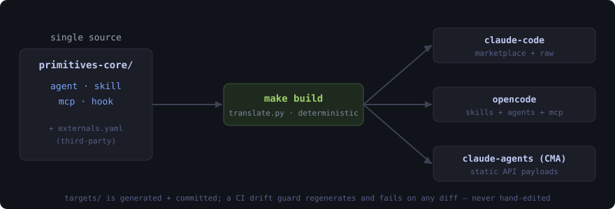
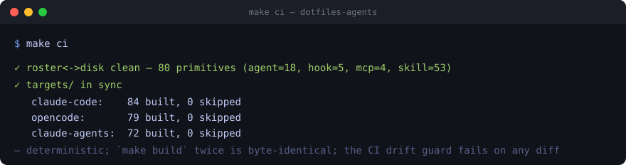

# dotfiles-agents

One source of truth for Henry's coding-agent **extenders** — skills, agent personas, MCP servers, and hooks — compiled from a single set of primitives into ready-to-deploy bundles for **Claude Code, opencode, and Claude managed agents**.



## Why this exists

Run more than one coding agent and the same capability gets re-authored three ways: a skill for Claude Code, a reshaped agent for opencode, an API payload for managed agents. They drift. You fix a prompt in one place and forget the other two. The usual "fix" — hand-editing each tool's config — *is* the bug.

This repo inverts that: **you author a primitive once** in `primitives-core/`, and a deterministic build renders it into every tool's native shape. Editing a generated target is impossible to do by accident, because a CI drift guard regenerates everything and fails on any diff.

## What you get today

- **Author once, deploy three ways.** 80 proven primitives — **53 skills · 18 agents · 5 hooks · 4 self-authored MCP servers** — compiled to all three targets from one source. Skills drop in natively; agents transform into opencode frontmatter; managed-agents get static `POST /v1/agents` + `/v1/skills` payloads; MCP servers render to each tool's own config schema.
- **A build you can trust.** `make build` is deterministic (stable ordering, no clocks) — running it twice is byte-identical. Two CI drift guards (`roster ↔ disk` and `targets/`) mean the committed bundles can't silently fall out of sync with the source.
- **MCP without copy-paste.** Self-authored servers live as neutral connection specs in `primitives-core/mcp/`; curated third-party servers (github, azure, chrome-devtools, the Anthropic design connector) are tracked in `externals.yaml` and rendered too. Secrets are never committed — they render as `${VAR}` placeholders resolved from the Keychain at deploy.
- **A clean task interface.** `make help` lists every target; CI runs the same `make ci` you do.

### Proof — `make ci`, run fresh



The image is the verbatim output. Reproduce it yourself — same result, because the build is deterministic:

```console
$ make ci
✓ roster<->disk clean — 80 primitives (agent=18, hook=5, mcp=4, skill=53)
✓ targets/ in sync — claude-code: 84 built, 0 skipped · opencode: 79 built, 0 skipped · claude-agents: 72 built, 0 skipped
```

(CC and opencode counts exceed 80 because the 4 self-authored + 4 third-party MCP servers render on top of the roster primitives; CMA is remote-only, so only the remote `claude_design` server reaches it.)

Generated artifacts are real and inspectable — e.g. the github MCP fragment proves the secret-hygiene claim (placeholder, never a literal token):

```json
"env": { "GITHUB_PERSONAL_ACCESS_TOKEN": "${GITHUB_PERSONAL_ACCESS_TOKEN}", "GITHUB_TOOLSETS": "all" }
```

## What it is *not* (yet)

- **Private and self-only.** This is Henry's personal extender set, not a public marketplace. No redistribution; nothing here is packaged for general use.
- **The build emits, it doesn't deploy.** Managed-agent payloads and MCP fragments are *static artifacts* — the build writes the POST bodies and config fragments; it does not call any API or merge them into a live config. Placement is a separate concern (`dotfiles-bootstrap`).
- **Third-party *skills/plugins* are tracked but not yet cloned.** `externals.yaml` lists ~30 external skills/plugins with upstream URLs still unresearched; only the MCP externals render today. The skill/plugin clone-at-build path is unbuilt.
- **Not a framework.** It standardizes *Henry's* primitives and conventions; it isn't a general toolkit for authoring agent extenders.

## Roadmap

Tracked in [GitHub issues](https://github.com/hsb3/dotfiles-agents/issues) (the five build phases are closed). Known remaining work:

- Skill/plugin **clone-at-build** externals path (research upstream repos + pin refs).
- Promote workbench candidates through the ratified qualification gate (≥2 cited real uses).
- `dotfiles-bootstrap` polish: wire `dotfiles install.sh`, auto marketplace-add, Linux support.

## Structure

```
primitives-core/{skills,agents,mcp,hooks}/     the single source copies
primitives-core.yaml                           the roster (manifest over filename-sort)
externals.yaml + externals/mcp/                third-party extenders (tracked, not vendored)
scripts/translate.py                           the build (stdlib-only, deterministic)
targets/{claude-code,opencode,claude-agents}/  generated bundles — never hand-edited
```

- **Canonical page** (wins over everything): [`docs/CHARTER.md`](docs/CHARTER.md)
- **Agent guide:** [`CLAUDE.md`](CLAUDE.md) · [`AGENTS.md`](AGENTS.md)

Private. Deployed by the distribution CLI in `dotfiles`; not stowed.
