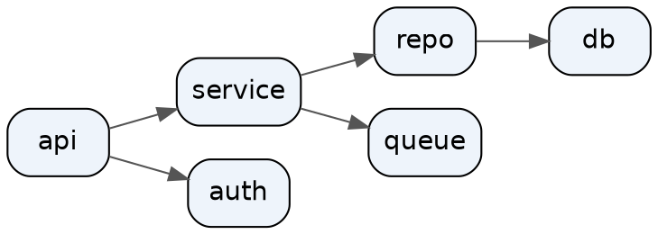

# Technical Diagrams Skill

Create architecture diagrams programmatically using the `diagrams` Python library or raw Graphviz dot. This skill is also the **hub** of the diagrams plugin: it owns tool selection, the raw-Graphviz workflow, and the output pipelines shared by every sibling skill.

## Scope and boundaries

One owner per fact — these boundaries keep skills from fighting over triggers:

- **This plugin owns structural diagrams only** — boxes, arrows, containment, flow. Architecture, sequence, dependency, org, process, ER structure.
- **Data charts and plots** (bar/line/scatter, dashboards, KPI tiles) → the separate `dataviz` skill. If the visual encodes a dataset, it is not this plugin's job.
- **Deck theming and palettes** → `pptx-themes`. This plugin renders diagram files; how a deck styles and lays out slides around them is owned there.

## Choosing the tool

| Need | Tool | Skill |
|---|---|---|
| GitHub-rendered repo docs, architecture flowcharts, auth sequence diagrams, ERDs, state diagrams | Mermaid | `mermaid` |
| Cloud architecture with provider icons — **Azure first** (primary platform), GCP (legacy product line), AWS/K8s/on-prem | Python `diagrams` | this skill |
| Dependency graphs, org/process trees, anything graph-shaped without provider icons | Raw Graphviz dot | this skill |
| Reading/converting legacy `.drawio` files, headless export of draw.io to PNG/SVG | draw.io | `drawio` |
| Sketch-style, hand-drawn-look architecture diagrams | Excalidraw | `excalidraw` |

Default for repo docs is Mermaid (renders in place on GitHub, diffable). Reach for Python `diagrams` when provider iconography earns its keep — exec briefings and architecture docs where an Azure Function icon reads faster than a labeled box.

**Self-improving workflow**: plan → code → render → review → adjust → **record learnings**

This skill accumulates knowledge in `memory/MEMORY.md`. Each diagram session:
1. **Starts** by checking memory for relevant past learnings
2. **Ends** by recording any new discoveries

**Key capability**: Diagrams supports custom Graphviz dot attributes for professional formatting via `graph_attr`, `node_attr`, and `edge_attr` parameters. See `references/graphviz-attrs.md` for comprehensive formatting options.

## Prerequisites

```bash
# In a project venv (preferred): uv add diagrams   — or: pip install diagrams
uv pip install diagrams
# Graphviz is required for rendering — install per platform:
brew install graphviz          # macOS
# apt-get install -y graphviz  # Debian/Ubuntu
```

## Workflow

This skill is **self-improving**. Always check the memory file before starting, and record learnings after completing diagrams.

### Phase 0: Check Memory (ALWAYS DO FIRST)

Before creating any diagram, read `memory/MEMORY.md` for accumulated learnings:

```bash
cat /path/to/skill/memory/MEMORY.md
```

Review relevant sections based on your task:
- **Import Errors** - Correct import paths discovered through trial
- **Layout Issues** - Spacing/direction fixes that worked
- **Styling Problems** - Attribute corrections
- **Connection/Flow Issues** - Edge routing solutions
- **Provider-Specific Notes** - Quirks for AWS/Azure/GCP/K8s/etc.
- **General Best Practices** - Tips that apply broadly

Apply any relevant learnings to your plan before coding.

### Phase 1: Plan

Before writing code, explicitly plan the diagram structure:

1. **Identify components** - List all nodes/services needed
2. **Define relationships** - Map data flows and connections
3. **Choose groupings** - Determine clusters for logical organization
4. **Select providers** - Match components to appropriate node types (AWS, Azure, GCP, K8s, OnPrem, Generic)
5. **Determine layout** - Choose direction (TB, BT, LR, RL) and nesting depth
6. **Define style** - Select formatting preset (corporate, presentation, technical, compact)

Output a structured plan before coding:

```
DIAGRAM PLAN:
- Title: [diagram name]
- Direction: [TB/LR/etc]
- Style: [corporate/presentation/technical/compact]
- Components:
  - [component1]: [provider.category.Node]
  - [component2]: [provider.category.Node]
- Clusters:
  - [cluster_name]: [component1, component2]
- Flows:
  - [source] >> [target] (label: [description])
```

### Phase 2: Code

#### Basic Structure

```python
from diagrams import Diagram, Cluster, Edge

with Diagram("Name", show=False, filename="output", direction="TB"):
    # nodes and connections
```

#### Key Parameters

| Parameter | Values | Purpose |
|-----------|--------|---------|
| `show` | `False` | Disable auto-open (required for headless) |
| `filename` | string | Output path without extension |
| `outformat` | `"png"`, `"svg"`, `"pdf"`, `"jpg"` | Output format |
| `direction` | `"TB"`, `"BT"`, `"LR"`, `"RL"` | Layout direction |
| `graph_attr` | dict | Graph-level Graphviz attributes |
| `node_attr` | dict | Default node Graphviz attributes |
| `edge_attr` | dict | Default edge Graphviz attributes |

#### Node Imports by Provider

```python
# AWS
from diagrams.aws.compute import EC2, Lambda, ECS, EKS
from diagrams.aws.database import RDS, DynamoDB, ElastiCache, Redshift
from diagrams.aws.network import ELB, Route53, VPC, CloudFront
from diagrams.aws.storage import S3
from diagrams.aws.integration import SQS, SNS, StepFunctions
from diagrams.aws.analytics import Kinesis, Athena, Glue

# Azure
from diagrams.azure.compute import FunctionApps, VM, AKS
from diagrams.azure.database import SQLDatabases, CosmosDb
from diagrams.azure.network import LoadBalancers, ApplicationGateway
from diagrams.azure.storage import BlobStorage

# GCP
from diagrams.gcp.compute import GCE, GKE, Functions, AppEngine
from diagrams.gcp.database import BigQuery, SQL, Spanner
from diagrams.gcp.network import LoadBalancing
from diagrams.gcp.storage import GCS
from diagrams.gcp.analytics import PubSub, Dataflow

# Kubernetes
from diagrams.k8s.compute import Pod, Deployment, StatefulSet, ReplicaSet
from diagrams.k8s.network import Service, Ingress
from diagrams.k8s.storage import PV, PVC, StorageClass
from diagrams.k8s.clusterconfig import HPA

# On-Premises / Generic
from diagrams.onprem.compute import Server
from diagrams.onprem.database import PostgreSQL, MySQL, MongoDB, Redis
from diagrams.onprem.network import Nginx, HAProxy
from diagrams.onprem.queue import Kafka, RabbitMQ
from diagrams.onprem.monitoring import Prometheus, Grafana
from diagrams.onprem.container import Docker
from diagrams.onprem.client import Users, Client

# Generic (provider-agnostic)
from diagrams.generic.compute import Rack
from diagrams.generic.database import SQL as GenericSQL
from diagrams.generic.network import Firewall
from diagrams.generic.storage import Storage

# Custom icons
from diagrams.custom import Custom
```

#### Connections

```python
# Flow operators
node1 >> node2           # left to right
node1 << node2           # right to left  
node1 - node2            # bidirectional (no arrow)

# Multiple targets
source >> [target1, target2, target3]

# Labeled/styled edges
node1 >> Edge(label="API call", color="blue", style="dashed") >> node2
```

#### Clusters

```python
with Diagram("Clustered", show=False):
    with Cluster("VPC"):
        with Cluster("Public Subnet"):
            lb = ELB("load balancer")
        with Cluster("Private Subnet"):
            web = [EC2("web1"), EC2("web2")]
    
    lb >> web
```

#### Graph Attributes

```python
graph_attr = {
    "fontsize": "20",
    "bgcolor": "white",      # or "transparent"
    "splines": "ortho",      # "spline", "line", "ortho", "curved"
    "nodesep": "0.8",
    "ranksep": "1.0",
}

with Diagram("Name", show=False, graph_attr=graph_attr):
    ...
```

## Professional Formatting with Graphviz Attributes

Diagrams supports custom Graphviz dot attributes for professional output. Pass dictionaries to `graph_attr`, `node_attr`, and `edge_attr`. For complete reference, see `references/graphviz-attrs.md`.

Full Graphviz docs: https://www.graphviz.org/doc/info/attrs.html

### Style Presets

#### Corporate/Clean Style
```python
graph_attr = {
    "fontsize": "16",
    "fontname": "Helvetica",
    "bgcolor": "white",
    "pad": "0.5",
    "nodesep": "0.8",
    "ranksep": "1.0",
    "splines": "ortho",
}

node_attr = {
    "fontsize": "12",
    "fontname": "Helvetica",
}

edge_attr = {
    "fontsize": "10",
    "fontname": "Helvetica",
}

with Diagram("Architecture", show=False, graph_attr=graph_attr, 
             node_attr=node_attr, edge_attr=edge_attr):
    ...
```

#### Presentation Style (Large, High Contrast)
```python
graph_attr = {
    "fontsize": "24",
    "fontname": "Arial",
    "bgcolor": "transparent",
    "pad": "1.0",
    "nodesep": "1.2",
    "ranksep": "1.5",
    "dpi": "150",
}

node_attr = {
    "fontsize": "18",
    "penwidth": "2.0",
}

edge_attr = {
    "penwidth": "2.0",
    "arrowsize": "1.5",
}
```

#### Compact Style (Many Nodes)
```python
graph_attr = {
    "fontsize": "10",
    "nodesep": "0.3",
    "ranksep": "0.4",
    "concentrate": "true",
}

node_attr = {
    "fontsize": "9",
    "width": "0.5",
    "height": "0.5",
}
```

### Essential Attributes Quick Reference

| Attribute | Scope | Values | Purpose |
|-----------|-------|--------|---------|
| `nodesep` | graph | 0.25-1.5 | Horizontal spacing between nodes (inches) |
| `ranksep` | graph | 0.5-2.0 | Vertical spacing between ranks (inches) |
| `splines` | graph | `ortho`, `spline`, `line`, `curved`, `polyline` | Edge routing style |
| `bgcolor` | graph | color/`transparent` | Background color |
| `pad` | graph | 0.1-1.0 | Padding around diagram (inches) |
| `dpi` | graph | 72-300 | Resolution for bitmap output |
| `fontsize` | all | 8-48 | Text size in points |
| `fontname` | all | font name | Font family (Helvetica, Arial, Courier) |
| `fontcolor` | all | color | Text color |
| `penwidth` | node/edge | 0.5-3.0 | Line thickness |
| `style` | node/cluster | `filled`, `rounded`, `dashed`, `bold` | Visual style |
| `fillcolor` | node/cluster | color | Fill color (requires `style=filled`) |
| `color` | all | color | Border/line color |
| `arrowsize` | edge | 0.5-2.0 | Arrow scale factor |
| `minlen` | edge | 1-5 | Minimum edge length (ranks) |
| `weight` | edge | 1-10 | Edge importance for layout |
| `constraint` | edge | true/false | Include edge in ranking |
| `compound` | graph | true/false | Allow edges between clusters |
| `concentrate` | graph | true/false | Merge parallel edges |

### Cluster Styling

```python
with Cluster("VPC", graph_attr={
    "style": "rounded,filled",
    "fillcolor": "#e8f4f8",
    "color": "#1976d2",
    "fontsize": "14",
    "fontcolor": "#1976d2",
    "labeljust": "l",  # left-align label
    "labelloc": "t",   # label at top
}):
    ...
```

### Edge Styling with Edge()

```python
from diagrams import Edge

# Styled connections
node1 >> Edge(
    label="API",
    color="blue",
    style="dashed",      # solid, dashed, dotted, bold
    penwidth="2.0",
    fontsize="10",
    fontcolor="gray",
    minlen="2",          # minimum length in ranks
    arrowhead="vee",     # normal, inv, dot, none, vee, diamond
    arrowsize="1.5",
) >> node2
```

### Phase 3: Render

Execute the Python script to generate the image:

```bash
python diagram_script.py
```

Output file appears in working directory with specified filename.

### Phase 4: Review

After rendering, load and examine the image:

1. **Check layout** - Are components arranged logically?
2. **Verify connections** - Do all flows appear correctly?
3. **Assess readability** - Are labels clear? Overlapping?
4. **Validate completeness** - Are all required components present?
5. **Compare to requirements** - Does it match the original plan/request?

### Phase 5: Adjust

Common fixes:

| Problem | Solution |
|---------|----------|
| Overlapping nodes | Add `nodesep`/`ranksep` to graph_attr |
| Wrong flow direction | Change `direction` parameter |
| Cluttered connections | Use clusters to group related nodes |
| Missing icons | Use `Custom()` with downloaded icon |
| Edge labels overlap | Adjust `minlen` in Edge() |
| Nodes in wrong order | Reverse declaration order (rendered in reverse) |

Iterate phases 2-5 until output meets requirements.

### Phase 6: Reflect and Record (ALWAYS DO AFTER)

After completing a diagram, reflect on the process:

1. **Did any errors occur?** (imports, syntax, rendering)
2. **Were adjustments needed?** (layout, spacing, styling)
3. **What fixed the issues?** (specific attribute values, import paths)
4. **Would this help future diagrams?**

If you learned something new, append it to `memory/MEMORY.md`:

```markdown
### [Date] - [Brief Title]
**Problem**: [What went wrong]
**Solution**: [What fixed it]
**Example**:
```python
# Code snippet if applicable
```
```

#### What to Record

**DO record:**
- Import path corrections (e.g., "Use `diagrams.aws.network` not `diagrams.aws.networking`")
- Attribute values that fixed layout issues (e.g., "`nodesep=1.2` needed for 10+ nodes")
- Provider-specific quirks discovered
- Styling combinations that worked well
- Edge cases and their solutions

**DON'T record:**
- User-specific requirements
- One-off diagram structures
- Obvious errors (typos, missing imports)

#### Memory File Structure

Append learnings to the appropriate section:

```markdown
## Import Errors

### 2025-01-15 - Azure SQL Import
**Problem**: `from diagrams.azure.database import SQL` failed
**Solution**: Use `SQLDatabases` instead of `SQL`
**Example**:
```python
from diagrams.azure.database import SQLDatabases  # NOT SQL
```

## Layout Issues

### 2025-01-15 - Overlapping K8s Pods
**Problem**: Pod nodes overlapped when using 5+ replicas
**Solution**: Increase nodesep and use vertical layout
**Example**:
```python
graph_attr = {"nodesep": "1.0", "ranksep": "0.8"}
with Diagram("K8s", direction="TB", graph_attr=graph_attr):
    ...
```
```

This creates a growing knowledge base that improves diagram quality over time.

## Patterns

### Data Pipeline

```python
from diagrams import Diagram, Cluster
from diagrams.aws.analytics import Kinesis, Glue, Athena
from diagrams.aws.storage import S3
from diagrams.aws.database import Redshift

with Diagram("Data Pipeline", show=False, direction="LR"):
    source = Kinesis("stream")
    
    with Cluster("Processing"):
        raw = S3("raw")
        transform = Glue("ETL")
        processed = S3("processed")
    
    with Cluster("Analytics"):
        warehouse = Redshift("DW")
        query = Athena("query")
    
    source >> raw >> transform >> processed
    processed >> warehouse
    processed >> query
```

### Microservices

```python
from diagrams import Diagram, Cluster, Edge
from diagrams.aws.compute import ECS
from diagrams.aws.database import RDS, ElastiCache
from diagrams.aws.network import ELB, Route53
from diagrams.aws.integration import SQS

with Diagram("Microservices", show=False):
    dns = Route53("DNS")
    lb = ELB("ALB")
    
    with Cluster("Services"):
        api = ECS("API Gateway")
        users = ECS("Users")
        orders = ECS("Orders")
        notify = ECS("Notifications")
    
    with Cluster("Data"):
        db = RDS("PostgreSQL")
        cache = ElastiCache("Redis")
        queue = SQS("Queue")
    
    dns >> lb >> api
    api >> users >> db
    api >> orders >> db
    orders >> queue >> notify
    users >> cache
```

### Kubernetes Deployment

```python
from diagrams import Diagram, Cluster
from diagrams.k8s.compute import Pod, Deployment
from diagrams.k8s.network import Service, Ingress
from diagrams.k8s.storage import PVC

with Diagram("K8s App", show=False, direction="TB"):
    ingress = Ingress("ingress")
    
    with Cluster("Namespace"):
        svc = Service("service")
        with Cluster("Deployment"):
            pods = [Pod("pod-1"), Pod("pod-2"), Pod("pod-3")]
        storage = PVC("data")
    
    ingress >> svc >> pods
    pods >> storage
```

## Custom Icons

```python
from diagrams import Diagram
from diagrams.custom import Custom
from urllib.request import urlretrieve

# Download icon
icon_url = "https://example.com/icon.png"
icon_path = "custom_icon.png"
urlretrieve(icon_url, icon_path)

with Diagram("Custom", show=False):
    custom_node = Custom("My Service", icon_path)
```

## Raw Graphviz for dependency graphs and trees

When no provider icon is needed — dependency graphs, org charts, process trees — skip the Python wrapper and write dot directly. Same install (`graphviz`), same attribute vocabulary (`references/graphviz-attrs.md` applies verbatim).



```bash
dot -Tsvg deps.dot -o deps.svg
dot -Tpng -Gdpi=150 deps.dot -o deps.png
```

- Trees (org/process): default `dot` engine, `rankdir=TB`. Large undirected graphs: try `neato` or `fdp`; circular: `circo`.
- `strict digraph` deduplicates parallel edges automatically.
- Clusters need the `cluster_` name prefix (`subgraph cluster_platform { ... }`) to draw a border.

## Output pipelines

Every diagram ships as **SVG + PNG side by side** — SVG for crisp embedding and diffs, PNG for surfaces that can't take SVG (PowerPoint compatibility, chat, thumbnails). Three consumption surfaces:

### 1. GitHub-rendered markdown

- Prefer Mermaid in-page (see the `mermaid` skill) — it renders natively and diffs cleanly.
- For rendered images, commit both formats under the doc's asset dir and embed the SVG: ``.

### 2. PowerPoint decks / exec briefings

- Convention: **numbered PNG+SVG pairs in a dated briefing folder** — e.g. `2026-07-04-status-update/diagrams/01-data-storage-isolation.png` + `.svg`. Numbering fixes narrative order; the deck embeds the PNGs, the SVGs are the editable/scalable masters.
- Render PNG at `dpi="150"` minimum (200 for full-slide diagrams) so projection doesn't blur.
- Keep diagram backgrounds **white or transparent** and let the deck theme own slide styling (`pptx-themes` owns palettes — don't bake a deck palette into the diagram).

```python
# Python diagrams: render both formats in one run
with Diagram("Auth Architecture", show=False, filename="diagrams/04-auth-db-logins",
             outformat=["png", "svg"], graph_attr={"dpi": "150", "bgcolor": "white"}):
    ...
```

```bash
# Graphviz / dot equivalent
dot -Tsvg arch.dot -o diagrams/03-deploy-process.svg
dot -Tpng -Gdpi=150 arch.dot -o diagrams/03-deploy-process.png
```

### 3. Standalone architecture docs

- SVG embedded in the doc, PNG kept beside it for consumers that need raster.
- State the source of truth: commit the generating script (`.py` / `.dot`) next to the outputs so the diagram is regenerable, never hand-edited.

### Light/dark-friendly styling

- **Safest default**: white (not transparent) background + dark strokes — readable on any surface, including dark-mode GitHub which renders the image as-authored.
- `bgcolor="transparent"` only when the destination background is known and controlled (a deck slide); on dark-mode pages transparent + black text becomes unreadable.
- Keep text `#1f1f1f`-ish on light fills; avoid pure-saturated fills that fight both themes. Mermaid has genuinely theme-aware options — see the `mermaid` skill.

## Troubleshooting

| Issue | Cause | Fix |
|-------|-------|-----|
| `graphviz not found` | Graphviz not installed | `brew install graphviz` (macOS) / `apt-get install graphviz` (Debian) |
| File not created | Exception in code | Check for import/syntax errors |
| Image opens unexpectedly | `show=True` (default) | Set `show=False` |
| Nodes too close | Default spacing | Add `nodesep`/`ranksep` to graph_attr |
| Edges overlap nodes | Default routing | Set `splines="ortho"` or `"spline"` |
| Labels overlap | Crowded layout | Increase `pad`, `nodesep`, `ranksep` |
| Wrong import | Node not in expected module | Check [docs](https://diagrams.mingrammer.com/docs/nodes/aws) |
| Blurry output | Low resolution | Set `dpi="150"` or higher |
| Transparent bg needed | White default | Set `bgcolor="transparent"` |
| Edges cross clusters | Default behavior | Set `compound="true"`, use `lhead`/`ltail` |
| Nodes in wrong order | Declaration order | Reverse order or use invisible edges |

## References

- **Memory file**: `memory/MEMORY.md` - **CHECK FIRST** - Accumulated learnings
- **Node imports**: `references/nodes.md` - Complete import paths by provider
- **Patterns**: `references/patterns.md` - Ready-to-use architecture templates  
- **Graphviz attrs**: `references/graphviz-attrs.md` - Professional formatting attributes
- **Memory manager**: `scripts/memory_manager.py` - CLI for viewing/adding memory entries
- **Official node lists**: https://diagrams.mingrammer.com/docs/nodes/aws
- **Graphviz attributes**: https://www.graphviz.org/doc/info/attrs.html

### Memory Manager Usage

```bash
# View all memory
python scripts/memory_manager.py view

# View specific section
python scripts/memory_manager.py view --section "Import Errors"

# Search memory
python scripts/memory_manager.py search "spacing"

# Add new entry
python scripts/memory_manager.py add \
  --section "Layout Issues" \
  --title "Wide diagrams need LR direction" \
  --problem "Diagram too tall and narrow" \
  --solution "Use direction=LR for wide layouts" \
  --example 'with Diagram("Wide", direction="LR"): ...'

# List sections
python scripts/memory_manager.py sections
```
