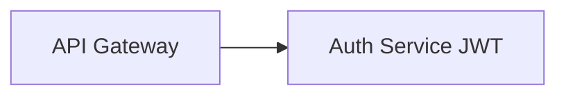
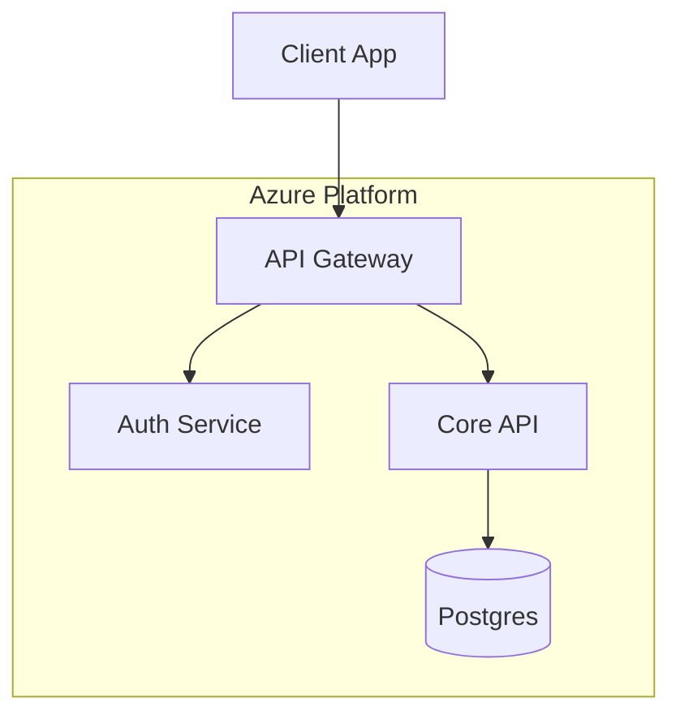
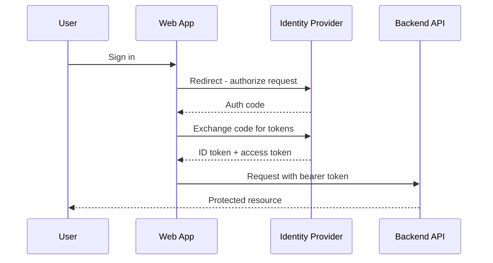
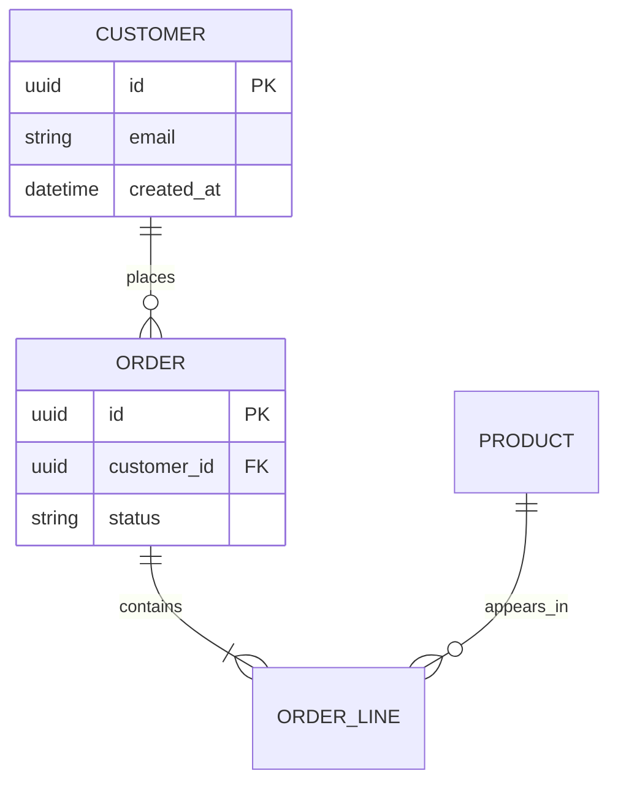
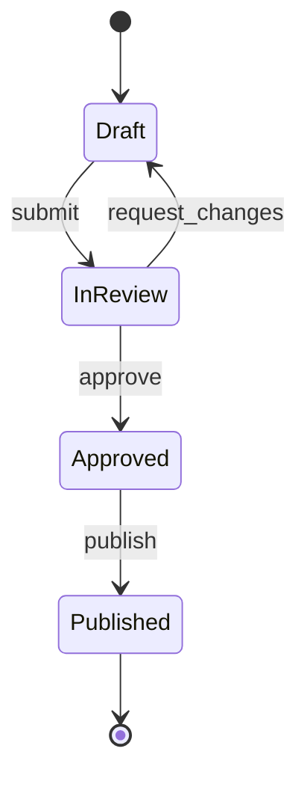

# Mermaid Diagrams

Mermaid is the workhorse for repo documentation: it renders natively on GitHub, lives in the markdown itself, and diffs like code. Default to Mermaid for any diagram destined for a `.md` file.

## HOUSE RULE — read before writing any node

> **No parentheses or special characters in node labels — they break rendering.**

This is a standing rule, not a suggestion. `(`, `)`, and other special characters (`{`, `}`, `[`, `]`, `#`, `;`, `"`, `<`, `>`, `&`) inside node labels cause silent or hard rendering failures depending on the renderer version. Rewrite the label instead:



- WRONG: `B[Auth Service (JWT)]`
- RIGHT: `B[Auth Service JWT]` or `B[Auth Service - JWT]`
- Applies to edge labels and subgraph titles too. Plain words, hyphens, and spaces only.
- Do not "fix" it with quoted labels or HTML entities — the rule is to avoid the characters entirely, so every renderer (GitHub, IDE previews, mermaid-cli) agrees.

## Scope

Structural diagrams only. Data charts → the `dataviz` skill (do not use Mermaid `pie`/`xychart` for real data viz). Provider-icon cloud architecture → the `diagrams` skill. Tool selection guide → the `diagrams` skill.

## Diagram types and when to use them

| Type | Use for | Opening line |
|---|---|---|
| Flowchart | Architecture, data flow, decision logic | `flowchart TD` or `flowchart LR` |
| Sequence | Auth flows, API call chains, message passing | `sequenceDiagram` |
| ER diagram | Database schema design | `erDiagram` |
| State | Lifecycles, status machines | `stateDiagram-v2` |
| Class | Object models, module structure | `classDiagram` |

### Flowchart



- `TD` top-down for hierarchies; `LR` left-right for pipelines and flows.
- Node shapes: `[box]`, `(rounded)`, `{diamond decision}`, `[(database)]`, `((circle))`.
- Edges: `-->` arrow, `---` line, `-. dashed .->`, `== thick ==>`, `-->|label|`.
- Group with `subgraph Name ... end`; subgraph titles obey the house rule too.

### Sequence (auth flows)



- `->>` solid arrow (request), `-->>` dashed (response), `-)` async.
- `activate`/`deactivate` or `+`/`-` suffixes show lifelines; `Note over A,B: text` annotates.
- `alt`/`else`/`end` for branches, `loop ... end` for retries.

### ER diagram (database design)



Cardinality: `||` exactly one, `o|` zero or one, `}o` zero or more, `}|` one or more. Left symbol pair = left entity's side.

### State diagram



## Light/dark theming

GitHub renders Mermaid with the viewer's theme automatically — **don't hardcode colors unless necessary**, and never assume a white page background.

- If styling is needed, use the init directive so it's explicit and self-contained:

```
%%{init: {"theme": "neutral"}}%%
```

- `neutral` is the safest single theme (readable on both light and dark). `default`, `dark`, `forest`, `base` also exist; `base` + `themeVariables` for fine control.
- Avoid `style N fill:#fff` one-offs — hardcoded light fills go invisible on dark GitHub. If you must color, pick mid-tone fills with dark text (see the light/dark guidance in the `diagrams` skill).

## Rendering to SVG/PNG (decks, docs outside GitHub)

GitHub needs no rendering step. For decks and standalone artifacts, render with mermaid-cli (no global install needed):

```bash
npx -y @mermaid-js/mermaid-cli -i arch.mmd -o diagrams/01-arch.svg
npx -y @mermaid-js/mermaid-cli -i arch.mmd -o diagrams/01-arch.png -s 2 -b white
```

- `-s 2` scale factor keeps PNG crisp for slides; `-b white` avoids transparent-background surprises.
- Ship SVG + PNG pairs per the output-pipeline conventions in the `diagrams` skill (numbered files in the artifact's `diagrams/` folder).

## Pitfalls

| Symptom | Cause | Fix |
|---|---|---|
| Diagram silently blank on GitHub | Special character in a label | Apply the house rule — strip `()` and friends |
| `Syntax error in text` | Reserved word as bare node id (`end`, `class`) | Rename the id (`fin`, `cls`) |
| Edge label breaks parse | `|` label containing special chars | Plain words only in edge labels |
| Renders in IDE, not on GitHub | Newer syntax than GitHub's Mermaid version | Stick to the core types above; avoid bleeding-edge features |
| Subgraph arrows ignored | Edge declared inside wrong subgraph scope | Declare nodes in subgraphs, edges at top level |
| Unreadable on dark mode | Hardcoded light fills | Remove styles or use `theme: neutral` |
