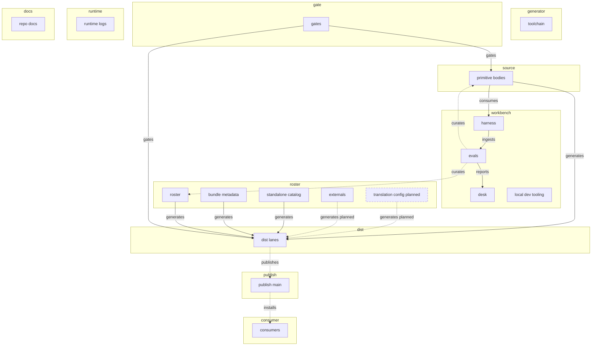

# Repo flow — the home of each part, and the DAG that proves it

_The end-to-end map: what is authored where, what generates what, what gates what, what
publishes where, and where the eval loop re-enters through the owner. Status: active
(2026-07-22). Machine form: `flow.yaml`, enforced by `make flow` (in `make ci`)._

Other docs carry the pieces — `README.md` the layout and build-interface tables, `CLAUDE.md`
the source-of-truth rules, `docs/CONTRIBUTING.md` the entry-gate SOP, the ADRs the whys.
This page carries the one thing none of them draw: the **edges**, in one graph, kept honest
by a drift guard.

## The spine

Hand-authored **sources** (`primitives-core/` bodies) and **control manifests** (the roster,
bundle metadata, standalone catalog, externals) are assembled by the **toolchain** into
**generated dist artifacts** (today: the Claude Code marketplace tree at the repo root),
**gated** by `make ci`, and **published** dev → main by the manual publish workflow, where
**consumers** install from. In parallel, the **workbench loop** runs candidates from the
sources through the agent **harness**, ingests results into **evals** (the extender-db
projection), and reports to the **desk** — and its findings re-enter the flow only through
the **owner's manual curation** of the roster and sources. That manual pass is the single
sanctioned cycle in the graph; every automated path is acyclic and the checker proves it.

## The DAG

Solid arrows are automated; dashed arrows are manual or planned; dashed nodes are planned
homes from ADR 0008 (vendor dist lanes under `dist/`, the revived translation config).

<!-- FLOW-DAG:BEGIN generated by scripts/check_flow.py --write-doc; do not hand-edit -->

<!-- FLOW-DAG:END -->

## The home of each part

Every top-level tracked path is claimed by exactly one node (enforced). Class: **H** authored,
**G** generated, **R** runtime.

| Path | Node | Layer | Class | Notes |
|---|---|---|---|---|
| `primitives-core/`, `hooks/` | primitive-bodies | source | H | the single source copy of every primitive body |
| `primitives-core.yaml` | roster | roster | H | authoritative membership; `targets` selects vendor lanes; `disposition` is owner-curated |
| `plugins.yaml` | bundle-metadata | roster | H | bundle id · kind · version · description |
| `skill-catalog.yaml` | standalone-catalog | roster | H | skills cleared to ship one-at-a-time |
| `externals.yaml` | externals | roster | H | third-party by reference; clone-at-build deferred (#36/#122) |
| `scripts/` | toolchain | generator | H | generators + every checker + campaign runner |
| `Makefile`, `tests/`, `.github/`, `.gitignore`, `flow.yaml` | gates | gate | H | task interface · unit tests · CI · tracking policy · this manifest |
| `dist/` | dist-lanes | dist | **G** | `dist/claude-code/` marketplace surface by `gen_marketplace.py` (`build-check`), lifted to main's root at publish; `dist/opencode/` laydown planned |
| `README.md`, `AGENTS.md`, `CLAUDE.md`, `docs/` | repo-docs | docs | H | entry docs, SOP, ADRs, this page |
| `_meta/` | desk | workbench | H | tracked desk (ADR 0006); operations/ content untracked |
| `harness/` | harness | workbench | H | uv eval project; own CI lane; `results.jsonl` tracked |
| `evals/` | evals | workbench | H | extender-db projection — never a source of truth |
| `.agents/`, `.claude/`, `skills-lock.json` | local-dev-tooling | workbench | H | session tooling for developing THIS repo; never distributed |
| `logs/` | runtime-logs | runtime | **R** | hook telemetry; must stay untracked |
| _(branch)_ `main` | publish-main | publish | — | advanced only by the publish workflow |
| _(planned)_ `translation.yaml` | translation-config | roster | H | capability matrix per primitive type × target |

## What the guard proves (`make flow`)

`scripts/check_flow.py` fails the build when:

- a tracked top-level path has **no home** or **two homes** in `flow.yaml`;
- a **planned** path already exists (the node must be flipped to current in the same PR);
- a **runtime** path becomes tracked, or a claimed path stops being tracked;
- a **generated** node's generator script is missing or it names no guard target;
- an edge references an unknown node, a current edge references a planned node, or a
  current edge's `via` file is gone;
- the **automated** current-edge graph contains a cycle — only `mode: manual` edges (the
  owner) may close loops;
- the DAG block above drifts from `flow.yaml` (regenerate with
  `python3 scripts/check_flow.py --write-doc`).

## Reading the loop

The workbench is deliberately **not** in the publish path: `make ci` never runs the harness
or evals, and nothing in `evals/` writes back to the roster. Battle-test evidence flows
`primitive-bodies → harness → evals → desk`, and returns to the flow only as the owner's
re-triage of `disposition:` and body edits — the two dashed `curates` edges. If an automated
writer to the roster is ever proposed, it must argue with the acyclicity check first.
