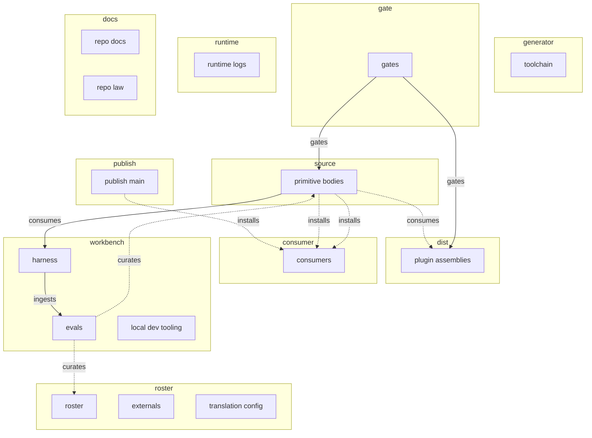

# Repo flow — the home of each part, and the DAG that proves it

_The end-to-end map: what is authored where, what generates what, what gates what, what
publishes where, and where the eval loop re-enters through the owner. Status: active
(2026-07-22). Machine form: `flow.yaml`, enforced by `make flow` (in `make ci`)._

Other docs carry the pieces — `README.md` the layout and build-interface tables, `CLAUDE.md`
the source-of-truth rules, the [contributor guide](../.github/CONTRIBUTING.md) the contribution loop, the ADRs the whys.
This page carries the one thing none of them draw: the **edges**, in one graph, kept honest
by a drift guard.

## The spine

Hand-authored **sources** (`primitives-core/` bodies) and **control manifests** (the roster,
bundle metadata, standalone catalog, externals) form hand-authored **symlink plugin assemblies** (the marketplace tree at the repo root),
**gated** by `make ci`, and **published** dev → main by the manual publish workflow, where
**consumers** install from. In parallel, the **workbench loop** runs candidates from the
sources through the agent **harness** and ingests results into **evals** (the extender-db
projection) — and its findings re-enter the flow only through
the **owner's manual curation** of the roster and sources. That manual pass is the single
sanctioned cycle in the graph; every automated path is acyclic and the checker proves it.

## The DAG

Solid arrows are automated; dashed arrows are manual (the owner and the publish/install
steps) or planned (the one remaining planned edge: externals clone-at-build, #36/#122).

<!-- FLOW-DAG:BEGIN generated by scripts/check_flow.py --write-doc; do not hand-edit -->

<!-- FLOW-DAG:END -->

## The home of each part

Every top-level tracked path is claimed by exactly one node (enforced). Class: **H** authored,
**G** generated, **R** runtime.

| Path | Node | Layer | Class | Notes |
|---|---|---|---|---|
| `primitives-core/` | primitive-bodies | source | H | the single source copy of every primitive body |
| `primitives-core.yaml` | roster | roster | H | authoritative provenance; `targets` selects harness support; `disposition` is owner-curated |
| `externals.yaml` | externals | roster | H | third-party by reference; clone-at-build deferred (#36/#122) |
| `scripts/` | toolchain | generator | H | generators + every checker + campaign runner |
| `Makefile`, `tests/`, `.github/`, `.gitignore`, `flow.yaml` | gates | gate | H | task interface · unit tests · CI · tracking policy · this manifest |
| `plugins/`, `.claude-plugin/` | plugin-assemblies | dist | H | pointer-based marketplace surface (ADR 0017): hand-authored thin symlink assemblies over `primitives-core/`, dereferenced at install; guarded by `scripts/check_symlinks.py` (`make symlinks`) |
| `README.md`, `AGENTS.md`, `CLAUDE.md` | repo-docs | docs | H | entry docs at the root (ADRs and this page live under `docs/`) |
| `docs/` | repo-law | docs | H | standing law in prose: `docs/decisions/` (ADRs), the extender-dev SOP, the vendoring rule, the diagram standard, this page |
| `harness/` | harness | workbench | H | eval harness; own test lane; see its README |
| `evals/` | evals | workbench | H | extender-db projection — never a source of truth |
| `.claude/`, `.vscode/`, `.kata.toml` | local-dev-tooling | workbench | H | session tooling for developing THIS repo; never distributed |
| `logs/` | runtime-logs | runtime | **R** | hook telemetry; must stay untracked |
| _(branch)_ `main` | publish-main | publish | — | advanced only by the publish workflow |
| _(virtual)_ | consumers | consumer | — | machines installing via `claude plugin marketplace add` or the laydown installers; nothing tracked here |
| `translation.yaml` | translation-config | roster | H | capability matrix per primitive type × target, model-alias pins, roster-level exclusions with reasons |

## What the guard proves (`make flow`)

`scripts/check_flow.py` fails the build when:

- a tracked top-level path has **no home** or **two homes** in `flow.yaml`;
- a **planned** path already exists (the node must be flipped to current in the same PR);
- a **runtime** path becomes tracked, or a claimed path stops being tracked;
- a **generated** node's generator script is missing or it names no guard target;
- an edge references an unknown node, a current edge references a planned node, or a
  current edge's `via` file is gone;
- the **automated** current-edge graph contains a cycle — only `mode: manual` edges (the
  owner) may close loops;
- the DAG block above drifts from `flow.yaml` (regenerate with
  `python3 scripts/check_flow.py --write-doc`).

## Reading the loop

The workbench is deliberately **not** in the publish path: `make ci` never runs the harness
or evals, and nothing in `evals/` writes back to the roster. Battle-test evidence flows
`primitive-bodies → harness → evals`, and returns to the flow only as the owner's
re-triage of `disposition:` and body edits — the two dashed `curates` edges. If an automated
writer to the roster is ever proposed, it must argue with the acyclicity check first.
