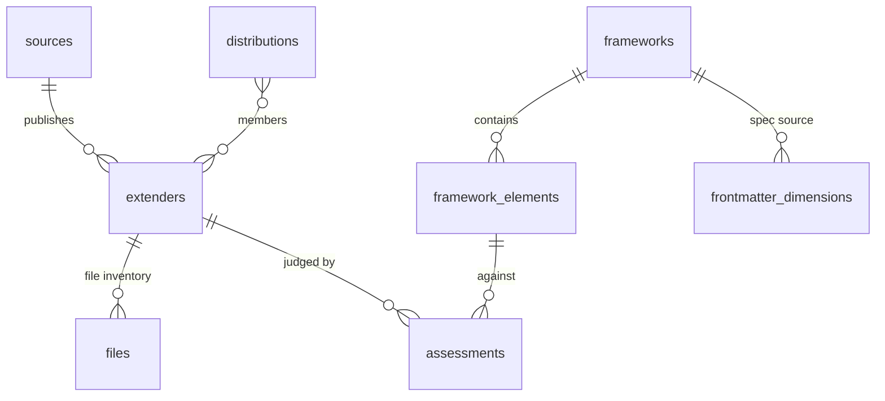

# extender-db — PocketBase inventory of agent extenders

_Internal analysis tool: a queryable database of this repo's agent extenders (their content,
structure, and packaging) plus the mental models used to compose and evaluate them._
Status: active (covers skills, agent personas, hooks, and externals-by-reference).

This is a mini-project — the project docs live in `_structure/`:
[CHARTER.md](_structure/CHARTER.md) is the canonical page (mission, scope, decisions, roadmap,
promotion gate), [PLAN.md](_structure/PLAN.md) carries deliverables/criteria/milestones,
[OPEN-ITEMS.md](_structure/OPEN-ITEMS.md) is the issue tracker, and
[INSIGHTS.md](_structure/INSIGHTS.md) is the running log of learnings feeding the eventual
comprehensive docs. This README is the operator doc; **[PROCEDURES.md](PROCEDURES.md) is
the runbook** — script run order, the evaluated-pass pattern, gates, and the data.db
commit discipline. Read it before running anything beyond serve/schema/ingest.

The repo itself stays the source of truth — this database is a **projection for analysis**,
rebuilt at any time by re-running the ingest. Never edit extender content here and expect it
to flow back; edit `primitives-core/` and re-ingest.

## Run it

```sh
evals/serve.sh             # server + admin UI (env-configured, see below)
python3 evals/schema.py    # create/update collections (idempotent)
python3 evals/ingest.py    # scan repo + seed frameworks (idempotent upserts)
```

Configuration resolves from env vars first, then `.claude/operations/extender-db.env`
(untracked), then defaults: `PB_DATA_DIR` (data directory; default
`evals/pb_data`), `PB_URL` (default `http://127.0.0.1:8090`),
`PB_BIND` (local server bind; default `127.0.0.1:8090`), and `PB_ADMIN_EMAIL` /
`PB_ADMIN_PASSWORD` (superuser, no default). `PB_URL` is only the REST endpoint used by
`pb.py`; it is never a server bind. PocketBase itself only takes the data dir as a `--dir`
flag — `serve.sh` is the env-var surface, and forwards any other subcommand with `--dir`
appended (e.g. `serve.sh superuser create EMAIL PASS`). The
live database is tracked in git as `pb_data/data.db` (private repo, ~6 MB), as is
`pb_data/storage/` (file-field blobs — harness artifacts, #174); the rest of
`pb_data/` — request logs (`auxiliary.db`), WAL/SHM journals, generated typings — is
transient and stays ignored. Stop the server before committing so the WAL is checkpointed
into `data.db`.
Admin UI: <http://127.0.0.1:8090/_/>. All collections are superuser-only (no public API rules).

## Responsibilities and deployment boundary

The harness is the offline producer of `harness/results.jsonl` and run logs.
`load_harness_runs.py` is the only projection boundary from those offline files into the
`runs`, `artifacts`, `run_events`, and `tool_calls` collections. `pb.py` is the shared
REST client for session-run schema/load/report commands; it does not own server startup.
`serve.sh` owns local PocketBase startup and its data directory only.

[`deploy/`](deploy/) is a fresh, empty PocketBase Railway bundle, pinned to PocketBase
0.40.3. It excludes `evals/pb_data`, historical auth state, and runtime artifacts; deployment
and recovery procedures are in [PROCEDURES.md](PROCEDURES.md#procedure-fresh-railway-deployment).

## Data model

Two halves, joined by `assessments`: the **inventory** (what the extenders ARE) and the
**doctrine** (the mental models we compose and judge them by).



### Inventory side

| Collection | One row per | Key fields |
|---|---|---|
| `extenders` | extender (skill or agent persona) | `slug` (unique, = roster id), `kind`, `description`, roster provenance (`origin`, `upstream`, `upstream_ref`, `shelf`, `disposition`, `requires`), `frontmatter` (parsed JSON), `body` (entrypoint markdown minus frontmatter), size metrics (`file_count`, `total_bytes`, `word_count`) |
| `files` | file inside an extender | `relpath`, `role` (entrypoint / reference / script / asset / template / eval / doc / license / config / other), full `content` (text files), `sha256`, `size_bytes`, `language`, `is_binary` |
| `distributions` | packaging unit | `slug`, `kind` (bundle / plugin / standalone), `version`, `members` (relation → extenders). From `plugins.yaml` + `skill-catalog.yaml`. |
| `frontmatter_dimensions` | (kind, frontmatter key) pair | `requirement` (required / optional / harness / custom / deprecated), `observed_count` across the catalog, `spec_framework` (which doctrine defines it). The custom rows are the interesting ones — keys we use that no spec defines. |
| `sources` | a trusted **publisher** of extenders | `slug`, `publisher_kind` (first-party / marketplace / individual / research-lab / community-collection), `publishes` (which kinds), `trust_tier` (trusted / provisional / watch / avoid), `publishes_evals`, `maintenance`, `license`, `adoption_signal`, cited `rationale` + `evidence_url`. Curated from research (EDB-15). `extenders.source` links each external to its publisher; the tier decides eligibility to vendor / reference / use as a W8 comparator baseline. |

### Doctrine side (the mental models)

| Collection | One row per | Key fields |
|---|---|---|
| `frameworks` | a named mental model | `kind` (archetype-set / section-taxonomy / authoring-spec / schema-spec / evaluation-rubric / principles), `source_org` + `source_url` (provenance: Anthropic-published vs internal), `applies_to`, `status` (active / candidate / superseded) |
| `framework_elements` | archetype, section, component, rule, or principle within a framework | `element_kind`, `description`, `criteria` (how a judge decides presence), `sort_order` |
| `eval_runs` | one evaluation campaign | `kind` (mechanical / judged / adversarial-review / adjudication / comparative / experiment), `method` (how it was designed and executed), `criteria_text` (the full criteria document), `frameworks`, `status` |
| `eval_responses` | one agent's contribution to a run | `role` (unique per run), `agent_type`, `model`, `prompt` (the exact dispatch text), `response_text` (verbatim final message), `response_json` (parsed verdicts), `extenders` covered, `tokens`, `duration_ms` |
| `assessments` | one verdict: extender × framework element × assessor | `verdict` (present / partial / absent / not-applicable), `evidence`, `score` (optional), `assessor`, `eval_run` (provenance link — every verdict resolves to the run, prompt, and response that produced it) |

**Assessor discipline:** `assessor` distinguishes who judged. `mechanical-v1` rows are
regenerated by `ingest.py` (checkable-by-code rules only: frontmatter presence/length,
SKILL.md line counts, bundled-resource dirs). Judgment calls — archetype tagging, section
taxonomy, "is this single-responsibility" — are written by humans or review agents under a
different assessor value and are never touched by the ingest. The unique index is
(extender, framework, element, assessor), so mechanical and judged verdicts coexist per element.

### Harness telemetry side (#174)

The agent-harness run-log corpus (`harness/results.jsonl` + `harness/runs/*.log`),
normalized for agent-usage analytics. Loaded by `load_harness_runs.py`; joined to the rest
of the model informally (a run's `candidate` slug matches `extenders.slug`).

| Collection | One row per | Key fields |
|---|---|---|
| `runs` | harness trial (ledger row ⋈ log) | the 7-field resume key (`campaign`,`harness`,`model`,`candidate`,`case`,`config`,`trial` — unique), `era` (legacy / post / na), `session_id` (unique when present; the log↔run join), verdict + token/cost/turn counts, `checks`/`grades`/`model_usage`/`provenance` (json), `log_path` |
| `run_events` | raw log line (minus `system/thinking_tokens` noise) | `run` (cascade), `seq` (unique per run), `role` (assistant / tool_call / tool_result / system / result), `event_type`, per-step tokens/cost, `payload` (json, mirror-deduped), `artifact` |
| `tool_calls` | tool call (claude call+result pair or opencode fused event) | `run` (cascade), `tool_call_id` (unique per run), `tool_name`, `input`/`output` (json), `status`, `wallclock_ms`, `artifact` |
| `artifacts` | distinct blob (content-addressed) | `sha256` (unique — global dedup), `kind` (write_content / edit_diff / screenshot / tool_output), `blob` (**file** field — written via `pb.create_multipart`, blobs live in tracked `pb_data/storage/`), `byte_size`, `text_ref` |

### Seeded frameworks

| Slug | Kind | Source | What it captures |
|---|---|---|---|
| `anthropic-agent-skills` | authoring-spec | Anthropic docs | SKILL.md entrypoint, name/description rules, progressive disclosure, references/scripts/assets, concise-body guideline |
| `claude-code-subagents` | schema-spec | Anthropic docs | Persona frontmatter (name/description/tools/model), system-prompt body, single responsibility |
| `hsb3-skill-archetypes` | archetype-set | internal (candidate) | What a skill fundamentally is: workflow-procedure, domain-expertise, deliverable-producer, guardrail-override, orchestration-delegation, scaffold-auditor |
| `skill-section-taxonomy` | section-taxonomy | internal (candidate) | Recurring SKILL.md section types (trigger, prerequisites, workflow steps, anti-patterns, output contract, integration partners, …) |
| `hook-dir-layout` | schema-spec | this repo | The ratified `hooks/<name>/hook.py` layout (`scripts/check_hook_layout.py`): Python-only handler, stdlib-only imports, co-located config |
| `dotfiles-agents-roster-schema` | schema-spec | this repo | The `primitives-core.yaml` entry schema (shelf, origin/provenance rule, disposition, membership, requires) |
| `hsb3-jobs-to-be-done` | job-taxonomy | internal (candidate) | The jobs Henry's agent work needs done (deliverable altitude, all-work scope), grouped by `category` into 7 families; 24 solution-agnostic job elements. W9 maps every extender to the jobs it serves |
| `skillopt` | evaluation-methodology | Microsoft (candidate) | Adopted quantitative eval+improvement method: skill-as-trainable-state, scored rollouts, validation-gated edits, cheap-model substrate, transcript-mined improvement. For W8/M5/M6 |
| `closedloop-judges` | evaluation-methodology | ClosedLoop.AI (candidate) | Adopted qualitative conformance pattern: judge-as-prompt-with-rubric emitting a CaseScore verdict, lightweight `{id,input,expected_outcome}` eval cases, a self-learning feedback loop. Maps onto our `assessments` |

If Anthropic later publishes a canonical archetype set, add it as a NEW framework row with
its citation and mark the internal one `superseded` — don't overwrite; comparing frameworks
against the same catalog is the point of the model.

## Example questions it answers

- Which skills exceed the concise-body guideline? → `assessments` where element
  `concise-body` and verdict ≠ present (currently: diagrams 653 lines, obsidian-cli 753 lines).
- What frontmatter keys do we use that no spec defines? → `frontmatter_dimensions` where
  `requirement = custom` (currently: skill `metadata`/`version`, agent `memory`).
- Which skills ship scripts vs pure-prose? → `files` grouped by `role`.
- Coverage of a bundle: `distributions.members` expanded against assessments.

## Expansion path

- **Kinds:** `extenders.kind` and the dimension/framework vocabularies already carry
  `hook`, `mcp`, `command` — adding hooks/MCP servers is an ingest pass, not a schema change.
- **Externals:** third-party references in `externals.yaml` fit `extenders` with
  `origin = external` (no files ingested, upstream URL only).
- **Versioning over time:** if trend analysis is wanted later, snapshot `sha256`/metrics
  per git ref into a new `snapshots` collection rather than mutating rows.

## Files

- `pb.py` — minimal stdlib REST client (superuser auth, upsert helpers)
- `schema.py` — collection definitions; safe to re-run (merges by field name, preserves ids)
- `ingest.py` — repo scan + framework seeds + mechanical assessments; safe to re-run
- `load_eval_run.py` — manifest-driven loader for evaluation provenance (runs, prompts, responses)
- `load_assessments.py` — judged/review verdict loader (W1-style passes)
- `load_coverage.py` — coverage-mapping loader: full extender × job cross product, assessor `coverage-v1`
- `load_harness_runs.py` — harness telemetry ingester (#174): ledger + raw run logs →
  `runs`/`run_events`/`tool_calls`/`artifacts`; `--parse-only` (offline), `--dry-run`,
  `--campaign` scoping. See PROCEDURES "ingesting a harness campaign".
- `report.py` — regenerates the analysis surface from the DB: `coverage-matrix.md` +
  `analysis.md` (both generated — never hand-edit); `--fixtures dir` swaps in JSON dumps
  for credential-free development. Supersedes the former `render_matrix.py`.
- `coverage_gaps` (view collection) — read-only saved view over `job_coverage` ⋈ its job
  element, non-covered rows only (gaps + partials); browsable in the admin UI and API.
- `serve.sh` — env-configured server wrapper (`PB_DATA_DIR`, `PB_URL`, `PB_BIND`)
- `PROCEDURES.md` — the runbook: run order, evaluated-pass pattern, gates, commit discipline
- `DECISIONS-NEEDED.md` — open owner-decision batch (tracked as issue #153)
- `_structure/` — project docs: CHARTER, PLAN, OPEN-ITEMS, INSIGHTS
- `pb_data/` — the live database; `data.db` and `storage/` are tracked (logs/journals/typings ignored)

## Codex usage digest

`usage_digest.py` reads local JSONL streams without changing them. It sums only v2
`counter_state: observed` delta `tokens`, never cumulative snapshots. Other states,
legacy v1 occupancy/delegation rows, malformed rows, and future schemas remain visible
as coverage rather than becoming zero usage. Repeated inputs and exported files union by
`observation_id`; conflicting contents are reported.

```sh
python3 evals/usage_digest.py report --input /path/to/codex-usage.jsonl
python3 evals/usage_digest.py report --input host-a.jsonl --input host-b.jsonl --output report.json
python3 evals/usage_digest.py export --input /path/to/codex-usage.jsonl --host my-host --output my-host.jsonl
python3 -m unittest tests/test_usage_digest.py
```

Exports retain only documented safe usage fields, partitioned by host; they contain no
prompts or transcript content and can be imported like any other input. Retain source
JSONL as the durable record and regenerate reports or exports when needed.

`tokens` is `null` when no observed delta exists; legacy or error rows never imply zero
usage. Mixed reports are a known observed subtotal with explicit coverage. `root_child`
is `child` only with a nonempty `parent_id`, `root` only when `native_id` equals
`lifecycle_id`, otherwise `unknown`. Lifetime entries use a JSON tuple of host, lifecycle,
and native ID and take the maximum repeated snapshot; active, tool, and wait timing nulls
remain in coverage.
