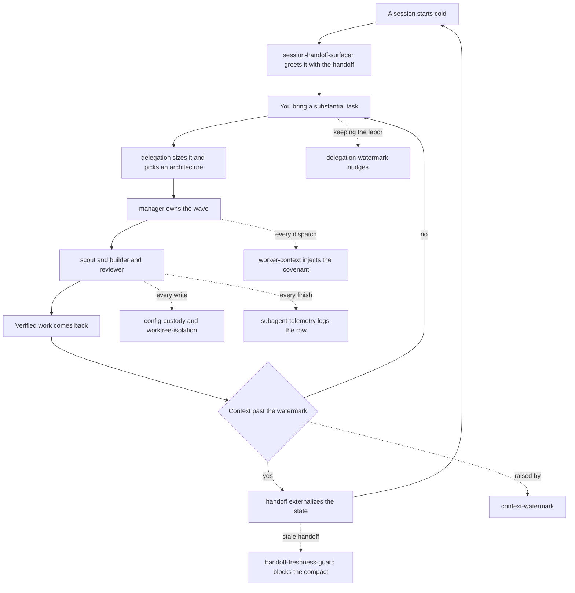

# atelier

A context-and-cost optimization kit for multi-agent work: size a task, pick a delegation
architecture, dispatch to the right model tier, and keep every session clearable instead of
letting context quietly run out. Skills, hooks, and agents across model tiers, all wired to
the same handoff file and the same session-discipline loop — including the review-cycle trio
(rubric-panel · deletion-pass · layer-cycle) distilled from a controlled agent-development
lab.

## How it fits together

One loop. `delegation` routes the work, the agents do it, and each hook fires at a fixed
point around them — then the context watermark hands the session to `handoff` and the loop
starts again cold. Dashed edges are the hooks watching a step, not steps of their own.



The review-cycle trio sits inside that `manager` box: `layer-cycle` drives a module through
create, evaluate, and refine, calling `rubric-panel` to score and `deletion-pass` to cut.

## What you get

| Primitive | Type | What it does |
|---|---|---|
| `delegation` | skill | Size a substantial task and route it across the three delegation layers — strategy (the session itself), management, execution: pick a delegation architecture (five options), bind slices to model-tiered agents, hold the never-delegated floor, and apply the findings-backed context-hygiene defaults. Two-level effort calibration keyed to the model in the session's strategist seat: standard by default, deep when a top-tier model leads. |
| `handoff` | skill | Maintain the project's session-handoff file so a brand-new session can pick up work cold — the externalization pass that makes a session clearable. |
| `waves` | skill | Drive a repo's issue backlog to closed with near-zero owner input: refresh a pinned triage issue (the living, ranked plan), group buildable issues into branch-sized waves, launch isolated crews via `delegation`, verify and merge each PR in declared order, reconcile, and externalize. Owner-gated decisions are queued and batched, never delegated. |
| `rubric-panel` | skill | Score one or more code artifacts against an anchored rubric with a persona-diverse judge panel (whole-field calibration, contested-spread flagging); outputs dimension scores plus findings classified as defect / noise / spec-hole / undeclared-commitment. |
| `deletion-pass` | skill | Simplify a module to irreducible against its contract: probe every line that cannot name the commitment it keeps (gate + golden-output diff per probe), keep true-noise deletions, and surface unwritten commitments as proposed contract amendments. Edit or dry-run mode. |
| `layer-cycle` | skill | Drive a module through create → evaluate → refine cycles until convergence or budget exhaustion — invokes `rubric-panel`, triages findings into scoped fix briefs and `deletion-pass` runs, amends the contract at the orchestrator level only. |
| `scout` | agent | Read-only recon — locate definitions, confirm presence/absence, inventory a scope, or reconcile evidence across files; returns a conclusion with path:line evidence, never a file dump. Defaults to the cheapest model tier. |
| `builder` | agent | Scoped implementation working inside an owned file list against explicit acceptance criteria. Defaults to a mid tier; dispatched at a higher tier for coupled or costly-to-unwind slices. |
| `reviewer` | agent | Adversarial, report-only verification — re-derives each claim from its cited source and re-runs its commands; never edits or fixes. |
| `manager` | agent | The management layer between strategy and execution — owns a wave or a coupled dependent chain end to end: turns the definition of done into worker briefs, spawns and sequences its own scouts, builders, and reviewers, and reports one proof package upward. The default for non-trivial work. |
| `config-custody` | hook (`PreToolUse`) | Denies **subagent** edits to the config listed under `protected:` in the activation file — the ownership map made machine-readable, so a worker cannot quietly edit the gate that defines its own acceptance. The main session is never restricted; only `enforce: strict` actually denies. |
| `context-watermark` | hook (`UserPromptSubmit`) | Warns when session context crosses the soft (70k) / hard (100k) token watermarks and nudges toward `/handoff` then `/clear` or `/compact`. Fails open; never blocks a prompt. |
| `delegation-watermark` | hook (`PostToolUse`) | Watches how much labor a session is *retaining*: counts delegable tool calls in an unbroken run with no dispatch, and past the watermark (25) nudges the session to delegate the remainder or name which floor item the stretch is. Observational; never blocks. |
| `handoff-freshness-guard` | hook (`PreCompact`) | Blocks a **manual** `/compact` when the project's handoff is stale or missing (run `/handoff` first); never blocks auto-compaction — fails open with non-blocking guidance instead. |
| `session-handoff-surfacer` | hook (`SessionStart`) | On a genuine cold start (startup or `/clear`), surfaces the existing handoff as a pointer plus a capped excerpt so a fresh session picks up prior work. Silent no-op on resume/compact or when no handoff exists. |
| `subagent-telemetry` | hook (`SubagentStop`) | Appends one row per delegation (agent id, agent type, model, context tokens) to a local ledger, so tier usage can be measured offline. Silent — no stdout, never blocks. |
| `worker-context` | hook (`SubagentStart`) | Injects the delegation covenant into every subagent, so the rules a worker is judged by arrive with the worker instead of depending on the dispatching session restating them in each brief. Inert until a project activates it. |
| `worktree-isolation` | hook (`PreToolUse`) | Rewrites a dispatch so a **writing** worker gets its own git worktree instead of sharing the session's checkout. Read-only roles are left alone on purpose — a worktree cannot see uncommitted work. Never denies; inert until a project sets `isolate:`. |

## Install

```
claude plugin install atelier@dotfiles-agents
```

## A worked example

```
You: "build the export feature — plan it out"
→ delegation sizes the job, picks an architecture, and routes scoped slices through the
  management and execution layers at the right model tier, holding verification for itself.

Context creeps past 70k tokens
→ context-watermark nudges: run /handoff, then /clear or /compact.

You: "/handoff"
→ handoff externalizes everything load-bearing into the project's HANDOFF.md.

You try a manual /compact with a stale handoff
→ handoff-freshness-guard blocks it and tells you to run /handoff first.

You /clear and start a new session
→ session-handoff-surfacer greets the fresh session with the handoff's pointer + excerpt,
  so it picks up cold without re-deriving prior state.

Meanwhile, every delegation
→ subagent-telemetry quietly logs agent/model/token usage for later review.
```

## Configuration

Everything ships with working defaults and none of this is required. There are two override
layers, and the practical difference between them is when a change takes effect.

### Per-project settings — `.claude/atelier.local.md`

The Claude Code convention for plugin-local settings is a `.claude/<plugin-name>.local.md` file
in the project root: YAML frontmatter for the settings, markdown below it for your own notes.
atelier reads `.claude/atelier.local.md`. It does not exist by default, and its absence is the
normal state — without it the enforcement layer is entirely off.

```markdown
---
effort: deep          # optional — force the delegation skill's effort level instead of inferring it
enforce: strict       # off (default when absent) | advisory | strict
protected:            # fnmatch patterns, project-relative; * crosses /
  - Makefile
  - .github/workflows/*
  - "*.config.js"
  - configs/*
isolate: writers      # off (default when absent) | writers | a list of agent types
---

# Why these paths

Anything below the frontmatter is ignored by the hooks — use it to tell your future self why
this project's gate is drawn where it is.
```

| Key | Read by | Effect |
|---|---|---|
| `effort` | `delegation` skill | Forces `standard` or `deep` rather than inferring the level from the session's strategist model. You saying so in the session still outranks it. |
| `enforce` | `worker-context`, `config-custody` hooks | Arms the enforcement layer. Absent, `off`, an unrecognized value, or an unparseable file all mean off. |
| `protected` | `config-custody` hook | fnmatch globs naming the config that defines acceptance. Also accepts the inline form `protected: ["Makefile", "configs/*"]`. `*` crosses `/`, so `configs/*` covers the whole subtree — if you want direct children only, name them. |
| `isolate` | `worktree-isolation` hook | Gives writing workers their own git worktree. `writers` covers `builder`, `manager`, `general-purpose`; a list (block or inline) names your own set. `scout`, `reviewer`, `Explore`, `Plan`, and `fork` are never isolated, even if listed — a worktree cannot see uncommitted work, which is exactly what a reviewer was sent to read. |

What each `enforce` level actually does:

| `enforce` | `worker-context` (SubagentStart) | `config-custody` (PreToolUse) |
|---|---|---|
| absent / `off` | silent | silent |
| `advisory` | injects the worker covenant into every subagent | logs would-be denials to `logs/config-custody.jsonl`; blocks nothing |
| `strict` | injects the covenant, naming the tool-layer block | denies subagent edits to `protected:` paths |

The main session is never restricted at any level: custody is scoped to subagents, so the
strategist keeps ownership of config and git and lifting a pattern is always available. Run
`advisory` for a few waves first and read the ledger — it records exactly what `strict` would
have blocked, so you graduate on evidence instead of turning enforcement on blind. To stand the
whole thing down, set `off` or delete the file.

`isolate:` is a separate axis and does not need `enforce:` — a project can isolate writers without
arming custody, or the reverse. Two things worth knowing before turning it on: an isolated worker
cannot see the session's uncommitted changes (commit first, or leave that worker un-isolated), and
a new worktree branches from `origin/<default-branch>` unless the project sets
`"worktreeBaseRef": "head"` in settings.json. Where the default branch is a publish-only surface,
`head` is the setting that hands workers the branch you are actually on.

**No restart needed.** The skill and the hooks re-read this file per call, so an edit to
`enforce:`, `protected:`, or `isolate:` applies to the very next tool call.

It is a local file, so ignore it:

```gitignore
.claude/*.local.md
```

### Session-wide settings — environment variables

Thresholds and file locations read from environment variables with shell-expanded defaults, so
you override one by setting it in `.claude/settings.json` (or `settings.local.json` for a
machine-local change):

```json
{
  "env": {
    "DELEGATION_WATERMARK_SOFT": "40",
    "CONTEXT_WATERMARK_SOFT": "90000"
  }
}
```

| Env var | Default | Meaning |
|---|---|---|
| `CONTEXT_WATERMARK_SOFT` | `70000` | Context tokens before the first nudge |
| `CONTEXT_WATERMARK_HARD` | `100000` | Context tokens before the hard warning |
| `DELEGATION_WATERMARK_SOFT` | `25` | Solo-run length (delegable calls, no dispatch) before the first nudge |
| `DELEGATION_WATERMARK_REFIRE_EVERY` | `15` | Further calls before nudging again |
| `DELEGATION_WATERMARK_STATE_DIR` | `/tmp/delegation-watermark` | Per-session anti-nag state |
| `ATELIER_ACTIVATION_FILE` | `$CLAUDE_PROJECT_DIR/.claude/atelier.local.md` | Where the activation file lives |
| `<HOOK>_LOG_PATH` | per hook, see right | `CONTEXT_WATERMARK_LOG_PATH` → `logs/context-watermark.jsonl`; `DELEGATION_WATERMARK_LOG_PATH` → `logs/delegation-watermark.jsonl`; `ATELIER_CUSTODY_LOG_PATH` → `logs/config-custody.jsonl`; `HANDOFF_GUARD_LOG_PATH` → `logs/handoff-guard.jsonl`; `HANDOFF_SURFACER_LOG_PATH` → `logs/handoff-surfacer.jsonl`; `SUBAGENT_TELEMETRY_LOG_PATH` → `logs/delegation.jsonl` (all under `$CLAUDE_PROJECT_DIR/`) |

**These need a fresh session.** Unlike the activation file, `env` is read once at startup, so an
edit does not reach the running session. The same goes for any change to `hooks.json`. Each
hook's own `hooks/<name>/README.md` documents its remaining knobs.

## Honest scope

Most of the hooks are nudges and guards, not enforcement of correctness: `context-watermark`,
`delegation-watermark`, and `handoff-freshness-guard` fail open on any error rather than risk
wedging a session, and none blocks automatic compaction. `subagent-telemetry` only records what
a subagent's own transcript reports — it cannot see or influence the parent session. The
delegation agents (`scout`/`builder`/`reviewer`/`manager`) are personas for the `delegation`
skill to dispatch; they don't run unless something explicitly delegates to them.

`config-custody` is the one hook that can genuinely block a call, and its limits are worth
knowing. It only denies when a project opts in with `enforce: strict` (`advisory` logs would-be
denials but blocks nothing), it never restricts the main session, and it matches paths lexically
— a symlink pointed at a protected file is not caught. That makes it a guardrail on honest tool
calls rather than a sandbox, which is also why its deny message names the correct move (stop and
report) instead of pretending to be airtight. The mechanism is covered by fixtures and an
adversarial matrix, but no real project has run under `strict` yet.
