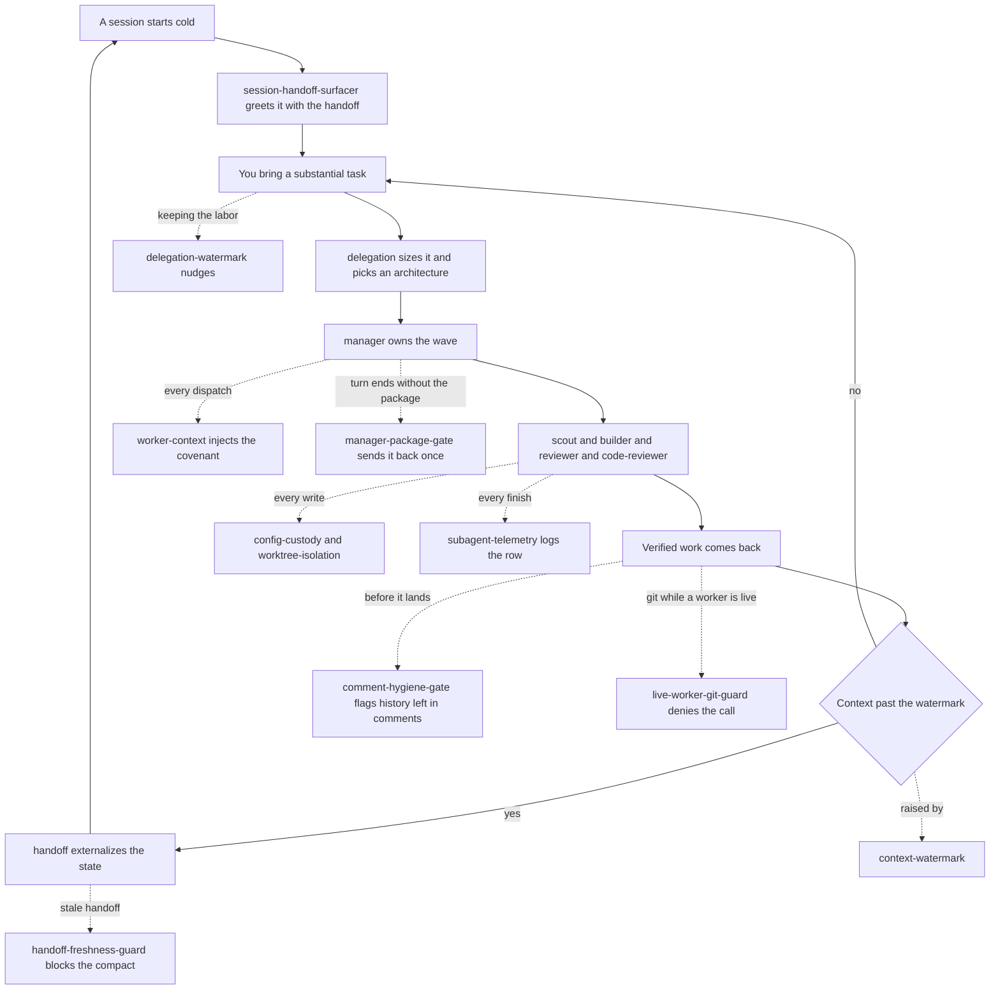

# atelier

A context-and-cost optimization kit for multi-agent work: size a task, pick a delegation
architecture, dispatch to the right model tier, and keep every session clearable instead of
letting context quietly run out. Skills, hooks, and agents across model tiers, all wired to
the same handoff target and the same session-discipline loop — including the review-cycle trio
(rubric-panel · deletion-pass · layer-cycle) distilled from a controlled agent-development
lab.

## How it fits together

One loop. `delegation` routes the work, the agents do it, and each hook fires at a fixed
point around them — then the context watermark hands the session to `handoff` and the loop
starts again cold. Dashed edges are the hooks watching a step, not steps of their own.



The review-cycle trio sits inside that `manager` box: `layer-cycle` drives a module through
create, evaluate, and refine, calling `rubric-panel` to score and `deletion-pass` to cut. The
refine phase runs `comment-hygiene` alongside `deletion-pass`: one cuts code that cannot name
its commitment, the other cuts comments that cannot.

## What you get

| Primitive | Type | What it does |
|---|---|---|
| `delegation` | skill | Size a substantial task and route it across the three delegation layers — strategy (the session itself), management, execution: pick a delegation architecture (five options), bind slices to model-tiered agents, hold the never-delegated floor, and apply the findings-backed context-hygiene defaults. Two-level effort calibration keyed to the model in the session's strategist seat: standard by default, deep when a top-tier model leads. Sizes a chain twice — how wide it may be, and whether one manager context can pay for it to the end — and orders a manager's own loop so the expensive, least-reversible proof runs before any optional refinement pass. |
| `handoff` | skill | Maintain the project's session-handoff file so a brand-new session can pick up work cold — the externalization pass that makes a session clearable. |
| `waves` | skill | Drive a project's backlog to closed with near-zero owner input: refresh the triage view (the living, ranked plan), group buildable items into branch-sized waves, launch isolated crews via `delegation`, verify and land each wave in declared order, reconcile, and externalize. Owner-gated decisions are queued and batched, never delegated. Tracker-agnostic — bindings ship for GitHub issues and kata; the kata binding states that its GitHub sync is import-only. |
| `rubric-panel` | skill | Score one or more code artifacts against an anchored rubric with a persona-diverse judge panel (whole-field calibration, contested-spread flagging); outputs dimension scores plus findings classified as defect / noise / spec-hole / undeclared-commitment. |
| `deletion-pass` | skill | Simplify a module to irreducible against its contract: probe every line that cannot name the commitment it keeps (gate + golden-output diff per probe), keep true-noise deletions, and surface unwritten commitments as proposed contract amendments. Edit or dry-run mode. |
| `layer-cycle` | skill | Drive a module through create → evaluate → refine cycles until convergence or budget exhaustion — invokes `rubric-panel`, triages findings into scoped fix briefs and `deletion-pass` runs, amends the contract at the orchestrator level only. Its defect branch now cites `test-quality` (ships in `solo-skills`) for what "red observed" has to mean, so a fix cannot be encoded as a test that could never fail. |
| `comment-hygiene` | skill | Strip history and commentary out of source comments before the work lands: harvest the reasoning onto its tracker item first, then keep only what a competent reader would break something without. The prose counterpart of `deletion-pass` — that one cuts code that cannot name its commitment, this one cuts comments that cannot. |
| `activation` | skill | Create and verify the per-project `.claude/atelier.local.md` activation file that arms the hooks below — distinguishes not configured from armed from present-but-silently-inert, since every hook loader fails open and the three look identical otherwise. |
| `activate` | command | `/atelier:activate` — arms atelier in the current project: creates the activation file if it is missing, then says in plain language what each hook actually resolved, including any key that is present but silently doing nothing. Drives the `activation` skill rather than repeating it, and is safe to hand to an agent: it never overwrites an existing file unasked. |
| `scout` | agent | Read-only recon — locate definitions, confirm presence/absence, inventory a scope, or reconcile evidence across files; returns a conclusion with path:line evidence, never a file dump. Defaults to the cheapest model tier. |
| `builder` | agent | Scoped implementation working inside an owned file list against explicit acceptance criteria. Defaults to a mid tier; dispatched at a higher tier for coupled or costly-to-unwind slices. |
| `reviewer` | agent | Adversarial, report-only verification — re-derives each claim from its cited source and re-runs its commands; never edits or fixes. |
| `code-reviewer` | agent | Senior-engineer code-quality pass — flags over-engineering, unnecessary abstraction, and needless complexity, then shows the cleaner form with before/after. The simplification counterpart to `reviewer`'s correctness focus. |
| `manager` | agent | The management layer between strategy and execution — owns a wave or a coupled dependent chain end to end: turns the definition of done into worker briefs, spawns and sequences its own scouts, builders, and reviewers, and reports one proof package upward. The default for non-trivial work. Dispatches synchronously by default, because a backgrounded worker's completion reaches its dispatcher only while that dispatcher is still mid-turn. |
| `comment-hygiene-gate` | hook (`PreToolUse`) | Silent until a Bash command is about to land work (`git commit`, `gh pr create`), then scans the added comment lines of the source files in that change for history markers — issue and board refs, dates, CI run ids, attributions — and names the files and a couple of examples. Skips prose files, where the harvested history is supposed to end up. Advisory; never blocks. |
| `config-custody` | hook (`PreToolUse`) | Denies **subagent** edits to the config listed under `protected:` in the activation file — the ownership map made machine-readable, so a worker cannot quietly edit the gate that defines its own acceptance. The main session is never restricted; only `enforce: strict` actually denies. |
| `context-watermark` | hook (`UserPromptSubmit`) | Warns when session context crosses the soft (120k) / hard (160k) token watermarks and nudges toward `/handoff` then `/clear` or `/compact`. Fails open; never blocks a prompt. |
| `delegation-watermark` | hook (`PostToolUse`) | Watches how much labor a session is *retaining*: counts delegable tool calls in an unbroken run with no dispatch, and past the watermark (25) nudges the session to delegate the remainder or name which floor item the stretch is. Observational; never blocks. |
| `live-worker-git-guard` | hook (`PreToolUse`) | Denies a mutating git call (`commit`, `push`, `merge`, `pull`, `rebase`, `checkout`, `stash`, `reset`, …) while this session has a live delegation sharing its checkout — a commit mid-run captures a half-applied edit, and a pull or checkout removes a worker's uncommitted files out from under it. Workers in their own worktree do not count, and neither does a command aimed at a different working tree than the one those workers share — the guard resolves the target tree from the command's cwd and its `-C`, and an ambiguity it cannot resolve leaves it deciding exactly as it did before it could compare trees at all. Read-only git never fires. Override, loudly, by prefixing `ATELIER_GIT_GUARD_OVERRIDE=1`; the override is recorded in the guard's ledger whether or not it suppressed a block, so it is never silent; never `git stash` around it. |
| `worker-git-scope-guard` | hook (`PreToolUse`) | Denies a **subagent's** mutating git that would destroy work it does not own. Two halves. A mutating `git stash` from a worker sharing the session's checkout is always denied — a stash takes the whole tree, so it sweeps up every sibling's uncommitted work and a conflicted pop plus a drop loses it; a worker in its own worktree is untouched, and `stash list` / `stash show` are reads. Separately, `commit`/`merge`/`rebase`/`cherry-pick`/`revert`/`am` with HEAD on a branch named in `protected-branches:`, and any `push` aimed at one, are denied — a worktree shares `.git` and the remote, so isolation is no protection there. The complement of `live-worker-git-guard`, which covers the orchestrator-versus-its-own-children case instead. |
| `manager-package-gate` | hook (`SubagentStop`) | Refuses a `manager`'s turn ending on a progress note: the final message must start `## Proof package` or `## Stopped: <condition>`, or the manager is sent back once to finish — every worker report it was "waiting on" has already been delivered. One nudge, never a loop; other agent types are untouched. |
| `handoff-freshness-guard` | hook (`PreCompact`) | Blocks a **manual** `/compact` when the project's handoff is stale or missing (run `/handoff` first); never blocks auto-compaction — fails open with non-blocking guidance instead. |
| `lane-snapshot` | hook (`SessionStart`) | Starts a background daemon that commits every agent worktree's working tree to `refs/lane-snapshots/<name>` every few minutes, so a worker's uncommitted output survives a crash or a mistaken prune. `pgrep`-guarded, so concurrent sessions share one daemon per repo. Recover with `git show refs/lane-snapshots/<name>:<path>`; check it is actually running with `python3 .../lane-snapshot/snapshot_lanes.py --check`. Adds refs only, never prunes. |
| `session-handoff-surfacer` | hook (`SessionStart`) | On a genuine cold start (startup or `/clear`), surfaces the existing handoff as a pointer plus a capped excerpt so a fresh session picks up prior work. Silent no-op on resume/compact or when no handoff exists. |
| `subagent-telemetry` | hook (`SubagentStop`, `Stop`) | Appends one row per delegation (agent id, agent type, model, context tokens, start time, duration) to a local ledger, so tier usage and per-agent wall clock can be measured offline. On `Stop` it also records delegations still pending past a threshold. Silent — no stdout, never blocks. |
| `worker-context` | hook (`SubagentStart`) | Injects the delegation covenant into every subagent, so the rules a worker is judged by arrive with the worker instead of depending on the dispatching session restating them in each brief. Inert until a project activates it. |
| `worktree-isolation` | hook (`PreToolUse`) | Rewrites a dispatch so a **writing** worker gets its own git worktree instead of sharing the session's checkout. Read-only roles are left alone on purpose — a worktree cannot see uncommitted work. Never denies; inert until a project sets `isolate:`. |

## Install

```
claude plugin install atelier@dotfiles-agents
```

## A worked example

```
You: "build the export feature — plan it out"
→ delegation sizes the job, picks an architecture, and routes scoped slices through the
  management and execution layers at the right model tier, holding verification for itself.

Context creeps past 120k tokens
→ context-watermark nudges: run /handoff, then /clear or /compact.

You: "/handoff"
→ handoff externalizes everything load-bearing into the project's handoff — the HANDOFF.md
  file, or the tracker item when `handoff:` is in external mode.

You try a manual /compact with a stale handoff
→ handoff-freshness-guard blocks it and tells you to run /handoff first.

You /clear and start a new session
→ session-handoff-surfacer greets the fresh session with the handoff's pointer + excerpt,
  so it picks up cold without re-deriving prior state.

Meanwhile, every delegation
→ subagent-telemetry quietly logs agent/model/token usage and wall clock for later review.
```

## Configuration

Everything ships with working defaults and none of this is required. There are two override
layers, and the practical difference between them is when a change takes effect.

### Per-project settings — `.claude/atelier.local.md`

The Claude Code convention for plugin-local settings is a `.claude/<plugin-name>.local.md` file
in the project root: YAML frontmatter for the settings, markdown below it for your own notes.
atelier reads `.claude/atelier.local.md`. It does not exist by default, and its absence is the
normal state — without it the enforcement layer is entirely off. Run `/atelier:activate` and it
is done for you: the file is created if missing, then checked, and you get back what each hook
actually resolved in plain language. Ask an agent to run it and the same thing happens
unattended. Reach for either instead of hand-copying the schema block below.

Under the command sits the `activation` skill, which is what an agent loads when it needs to
reason about activation mid-task rather than just perform it. To drive it directly from the
project root:

```bash
S="${CLAUDE_PLUGIN_ROOT}/skills/activation/scripts/activation.py"
python3 "$S" create   # write .claude/atelier.local.md and gitignore it
python3 "$S" check    # per key: armed, inert, or not configured
```

```markdown
---
effort: deep          # optional — force the delegation skill's effort level instead of inferring it
enforce: strict       # off (default when absent) | advisory | strict
protected:            # fnmatch patterns, project-relative; * crosses /
  - Makefile
  - .github/workflows/*
  - "*.config.js"
  - configs/*
protected-branches:   # branch NAMES, matched exactly; a different key from protected:
  - main
isolate: writers      # off (default when absent) | writers | a list of agent types
handoff: docs/HANDOFF.md   # optional — override where the handoff lives; set it only once
                           # that file exists (or use a {mode: external} mapping for a
                           # tracker or board — see the table below)
---

# Why these paths

Anything below the frontmatter is ignored by the hooks — use it to tell your future self why
this project's gate is drawn where it is.
```

| Key | Read by | Effect |
|---|---|---|
| `effort` | nothing — no hook reads this key | Prose-only signal for the `delegation` skill: it forces `standard` or `deep` **only if the agent opens this file and reads it**. Unlike the other four keys, nothing enforces it per call; you saying so in the session still outranks it. |
| `enforce` | `worker-context`, `config-custody` hooks | Arms the enforcement layer. Absent, `off`, an unrecognized value, or an unparseable file all mean off. |
| `protected` | `config-custody` hook | fnmatch globs naming the config that defines acceptance. Also accepts the inline form `protected: ["Makefile", "configs/*"]`. `*` crosses `/`, so `configs/*` covers the whole subtree — if you want direct children only, name them. |
| `protected-branches` | `worker-git-scope-guard` hook | Branch **names** a subagent may not commit, merge, rebase, cherry-pick, revert, or `am` onto, and may not push at. Matched exactly, never as globs; block or inline (`protected-branches: ["main", "release"]`) form. A **distinct key** from `protected:` above — that one names file paths for `config-custody`, and a file glob must never be read as a branch name. There is deliberately **no built-in list**: absent, empty, or unparseable leaves this half inert, because a hardcoded `main`/`master` default guards the wrong thing in every project whose default branch is a publish-only surface. Independent of `enforce:`. The same hook's stash half needs no key at all. A worker dispatched into a linked **worktree** finds no activation file there (a fresh checkout, and the file is gitignored) and so inherits the main checkout's list — without that fallback this key would switch itself off in the one place a worktree's shared `.git` makes it matter. **Claude Code only:** the opencode port ships no git guard and its activation parser does not read this key, so the doctrine describing it lives in a `harness:claude-code` block — see `docs/atelier-parity.md`. |
| `isolate` | `worktree-isolation` hook | Gives writing workers their own git worktree. `writers` covers `builder`, `manager`, `general-purpose`; a list (block or inline) names your own set. `scout`, `reviewer`, `Explore`, `Plan`, and `fork` are never isolated, even if listed — a worktree cannot see uncommitted work, which is exactly what a reviewer was sent to read. |
| `handoff` | `session-handoff-surfacer`, `handoff-freshness-guard` hooks | Overrides where the project's handoff lives. Two modes. **File** (a bare project-relative path, or `{mode: file, path: ...}`): an existing in-root file wins over the standard `_meta/HANDOFF.md` → `HANDOFF.md` → `.claude/HANDOFF.md` search; an in-root file that does not exist is still authoritative and turns handoff surfacing off (the trap); a path outside the project root is rejected and the standard search runs unchanged. **External** (`{mode: external, stamp: ..., location: ...}`), for a handoff kept on a tracker or board: `stamp` is a freshness signal judged by mtime, never the handoff itself; a missing/blank/out-of-root `stamp`, or an unrecognized `mode`, leaves the key inert and the standard search runs; once armed the surfacer always points a cold session at `location`, even before the stamp is first touched. |

What each `enforce` level actually does:

| `enforce` | `worker-context` (SubagentStart) | `config-custody` (PreToolUse) |
|---|---|---|
| absent / `off` | silent | silent |
| `advisory` | injects the worker covenant into every subagent | logs would-be denials to the `config-custody` stream; blocks nothing |
| `strict` | injects the covenant, naming the tool-layer block | denies subagent edits to `protected:` paths |

**Enforcement follows the main checkout into a linked worktree.** This file is gitignored by
convention, and a worktree is a clean checkout, so a worker dispatched with `isolation: worktree`
used to land somewhere the file simply was not — and ran with custody and the covenant off, in
exactly the dispatch shape isolation exists to protect. Every hook that reads the file now falls
back to the main checkout's copy when it finds nothing at its own project directory, and the same
fallback covers what the file *names* (a `handoff:` path, its freshness stamp).

**A worktree that has its own copy is governed by that copy.** `config-custody` resolves policy
from the tree the *edited file* sits in before it consults `CLAUDE_PROJECT_DIR`, which Claude Code
sets on the hook process to the main checkout even for an isolated worker. So if you **track** this
file, a worktree is held to the version committed on its own branch — read at that worktree's
`HEAD`, so an uncommitted edit to it changes nothing and an untracked copy governs nothing. A
permissive copy **committed** there does un-govern that worktree, deliberately: the change is
diffable and a reviewer sees it. It reaches no further, because policy is resolved from the tree
the edited file sits in and nothing else — an edit aimed at the main checkout or at a second
worktree is judged by that tree's copy. Full precedence order in
[`hooks/config-custody/README.md`](hooks/config-custody/README.md).

Only `config-custody` resolves this way so far. The other activation-reading hooks still read the
project directory alone and fall back to the main checkout, and one of them is `worker-context`,
which injects the covenant at subagent start. So a worker in a worktree whose committed copy
differs from the main checkout's can be handed covenant text that disagrees with the gate it
actually hits. Keep the two copies in step until the sibling hooks resolve the same way.

The main session is never restricted at any level: custody is scoped to subagents, so the
strategist keeps ownership of config and git and lifting a pattern is always available. Run
`advisory` for a few waves first and read the ledger — it records exactly what `strict` would
have blocked, so you graduate on evidence instead of turning enforcement on blind. To stand the
whole thing down, set `off` or delete the file.

`isolate:` is a separate axis and does not need `enforce:` — a project can isolate writers without
arming custody, or the reverse. Two things worth knowing before turning it on: an isolated worker
cannot see the session's uncommitted changes (commit first, or leave that worker un-isolated), and
a new worktree branches from `origin/<default-branch>` unless the project sets the **nested**
`worktree.baseRef` key in settings.json. Where the default branch is a publish-only surface,
`head` is the setting that hands workers the branch you are actually on:

```json
{
  "worktree": {
    "baseRef": "head"
  }
}
```

The key is nested under `worktree`; a flat top-level spelling of it is a `/config` widget id, not
a settings key, and is silently ignored.

A dispatcher that is itself in a linked worktree gets its writers **nested** under it, one branch
each, and the hook's notice hands it the integrate step at dispatch time. That step is
`git cherry HEAD <branch>` to name the commits not yet picked, then a cherry-pick of exactly those
— safe to re-run every round, unlike the range form, which exits 128 once a round has nothing new.

**No restart needed.** The skill and the hooks re-read this file per call, so an edit to
`enforce:`, `protected:`, `protected-branches:`, or `isolate:` applies to the very next
tool call.

It is a local file, so ignore it:

```gitignore
.claude/*.local.md
```

### Session-wide settings — environment variables

Thresholds and file locations read from environment variables with shell-expanded defaults, so
you override one by setting it in `.claude/settings.json` (or `settings.local.json` for a
machine-local change):

```json
{
  "env": {
    "DELEGATION_WATERMARK_SOFT": "40",
    "CONTEXT_WATERMARK_SOFT": "90000"
  }
}
```

| Env var | Default | Meaning |
|---|---|---|
| `CONTEXT_WATERMARK_SOFT` | `120000` | Context tokens before the first nudge |
| `CONTEXT_WATERMARK_HARD` | `160000` | Context tokens before the hard warning |
| `DELEGATION_WATERMARK_SOFT` | `25` | Solo-run length (delegable calls, no dispatch) before the first nudge |
| `DELEGATION_WATERMARK_REFIRE_EVERY` | `15` | Further calls before nudging again |
| `DELEGATION_WATERMARK_STATE_DIR` | `/tmp/delegation-watermark` | Per-session anti-nag state |
| `DELEGATION_WATERMARK_FLOOR_COMMANDS` | `kata,gh,make,git` | Shell command heads counted as never-delegated floor work, so a run of them does not raise the streak. Replaces the list rather than extending it. |
| `LANE_SNAPSHOT_INTERVAL` | `180` | Seconds between lane snapshots |
| `LANE_SNAPSHOT_WORKTREES` | `.claude/worktrees/agent-*` | Glob, relative to the repo root, matching the worktrees to snapshot. Deliberately unfenced, because worktrees legitimately live outside a repo: `../sibling-*` or an absolute pattern snapshots directories outside the root, and their refs still land in the root's namespace. |
| `LANE_SNAPSHOT_ROOT` | derived (hook payload `cwd`, else the script's own repo) | Repo whose lanes are snapshotted; overrides the derivation |
| `ATELIER_ACTIVATION_FILE` | `$CLAUDE_PROJECT_DIR/.claude/atelier.local.md` | Where the activation file lives |
| `<HOOK>_LOG_PATH` | the hook's stream under the log root (see **Ledgers** below) | Overrides one stream's path. `CONTEXT_WATERMARK_LOG_PATH` → `context-watermark`; `DELEGATION_WATERMARK_LOG_PATH` → `delegation-watermark`; `ATELIER_CUSTODY_LOG_PATH` → `config-custody`; `HANDOFF_GUARD_LOG_PATH` → `handoff-guard`; `HANDOFF_SURFACER_LOG_PATH` → `handoff-surfacer`; `SUBAGENT_TELEMETRY_LOG_PATH` → `delegation`; `WORKTREE_ISOLATION_LOG_PATH` → `worktree-isolation`; `LIVE_WORKER_GIT_GUARD_LOG_PATH` → `live-worker-git-guard`; `MANAGER_PACKAGE_GATE_LOG_PATH` → `manager-package-gate`; `LANE_SNAPSHOT_LOG_PATH` → `lane-snapshot` |
| `XDG_DATA_HOME` | `~/.local/share` | Base of the log root. Ignored when relative. |

**These need a fresh session.** Unlike the activation file, `env` is read once at startup, so an
edit does not reach the running session. The same goes for any change to `hooks.json`. Each
hook's own `hooks/<name>/README.md` documents its remaining knobs.

## Ledgers

Hooks do not write into your project. Every stream lands in one partitioned root:

```
${XDG_DATA_HOME:-~/.local/share}/agent-logs/claude-code/atelier/<stream>.jsonl
```

The partitioning is what lets more than one plugin, on more than one harness, share a
single analytics-ready dataset: the opencode mirror of these hooks writes the same shape
under its own `<harness>` segment. Every row carries an identity envelope first, then the
hook's own fields:

```json
{"v":1,"plugin":"atelier","harness":"claude-code","stream":"config-custody",
 "ts":"2026-08-20T15:37:08.666Z","project":"/repo/x","tool_name":"Edit","denied":false}
```

`stream` keeps a row attributable once files are concatenated, `v` is the schema version,
and `project` replaces what used to be a per-project directory. `ts` is ISO-8601 UTC, so
rows sort lexically in the order they happened.

One helper owns every append (`hooks/_lib/agentlog.py`); no hook writes its own rows, which
is what keeps the envelope impossible to skip. Set a `<HOOK>_LOG_PATH` to divert a single
stream elsewhere.

## Honest scope

Most of the hooks are nudges and guards, not enforcement of correctness: `context-watermark`,
`delegation-watermark`, and `handoff-freshness-guard` fail open on any error rather than risk
wedging a session, and none blocks automatic compaction. `subagent-telemetry` records what a
subagent's own transcript reports, plus a scan for still-pending delegations on the parent's
`Stop`; it only ever writes to the ledger and never influences the session. The
delegation agents (`scout`/`builder`/`reviewer`/`manager`) are personas for the `delegation`
skill to dispatch; they don't run unless something explicitly delegates to them.

`worker-git-scope-guard` is a **tripwire, not containment**, and the distinction matters
because the thing it guards is unrecoverable. It reads the `Bash` command about to run, so
a worker that writes a shell script and executes that, or that drives git through any other
tool, is not caught; its parser splits on raw text, so a separator inside a quoted argument
can still hide an invocation. That is the same ceiling any string-based Bash tripwire
has, and the same reasoning: catching the path agents actually take and leaving a refusal in the
transcript is worth far more than the partial coverage costs. **Server-side branch
protection is the layer above it** — a local hook cannot stop a novel path to the remote,
a protected-branch rule on the forge can, so where a branch genuinely matters, configure
both. It is also the complement of `live-worker-git-guard`, never a replacement: that one
protects an orchestrator from clobbering its own live children, this one protects peer
workers from each other and protects named branches. Each is blind exactly where the other
looks, so running only one leaves a real loss unguarded. Both fail open on every error
path.

`config-custody` is the one hook that can genuinely block a call by matching paths, and its
limits are worth knowing. It only denies when a project opts in with `enforce: strict` (`advisory` logs would-be
denials but blocks nothing), it never restricts the main session, and it matches paths lexically
— a symlink pointed at a protected file is not caught. That makes it a guardrail on honest tool
calls rather than a sandbox, which is also why its deny message names the correct move (stop and
report) instead of pretending to be airtight. The mechanism is covered by fixtures and an
adversarial matrix, but no real project has run under `strict` yet.
