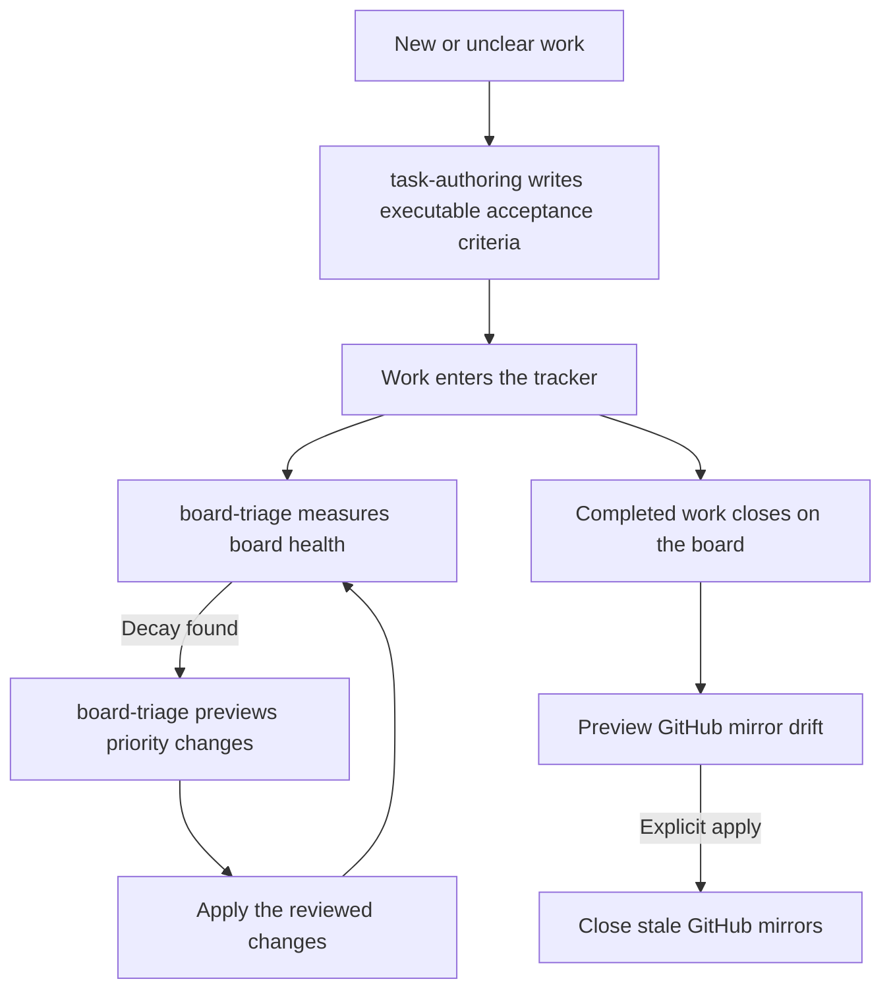

# board-desk

Turn captured work into executable tasks, keep priorities useful, and reconcile GitHub
mirrors after work closes on the board. The same Python stdlib scripts run from the
installed skill directory in Claude Code or Codex.

## How it fits together

Write the task before ranking it. Measure the board before changing priorities, then
check the result. GitHub reconciliation previews drift before any close is applied.



## What you get

| Skill | What it does |
|---|---|
| `task-authoring` | Writes task bodies with testable acceptance criteria, explicit gates and scoped ownership. Tracker-agnostic. |
| `board-triage` | Measures board-wide discrimination, ranks priorities through Kata or GitHub Projects adapters, and supplies the declared label vocabulary, relabel helper and GitHub mirror reconciler. Writes require explicit apply. |

## Install and use

```sh
claude plugin install board-desk@dotfiles-agents
```

For Codex: `codex plugin add board-desk@dotfiles-agents`.
Ask to author a work item or run board triage. Resolve scripts from the installed
board-triage skill directory; no plugin environment variable is required.

The adapters require their backend client: authenticated `gh` with project scope for
GitHub Projects, or `kata` connected to the chosen daemon. GitHub reconciliation needs
both clients and must run against the repository imported by the selected Kata project.
It is dry-run by default; `--apply` closes stale mirrors, never creates issues or cards.

For the full Kata maintenance rhythm, install `kata@kata-oversight` separately from
the kata-oversight marketplace. Its wiring check and per-card definition/dependency audit
remain upstream; this plugin's board health check measures how the whole board is grouped
and prioritized. Neither replaces the other. The dependency is a reference, not bundled
upstream code.

## Migration and limits

Board triage moved here from code-desk. Task authoring is primarily owned here and is
also carried by mise-en-place because its planning desk requires that standard. Both
assemblies link to the same canonical skill; enabling both lists task authoring twice.
Planning-desk remains in mise-en-place; backlog execution remains in Atelier.

The reconciler uses Kata's checkout selection unless `--project` is supplied. GitHub
repository selection remains with `gh`. It reports reverse drift without changing the
board. GitHub reads retain a limit of 500 issues per state, so larger repositories need
pagination before treating the report as a complete sweep.
