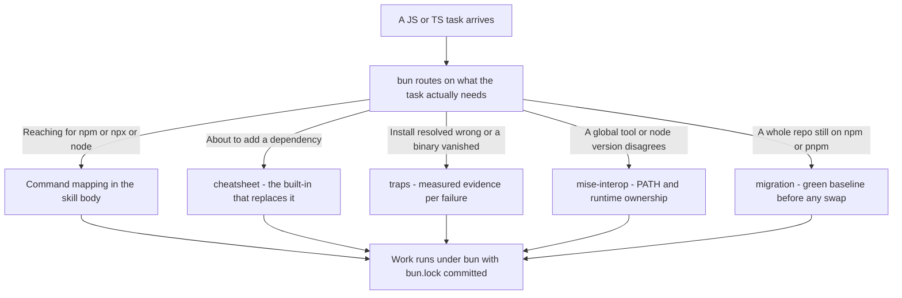

# bun

Bun as the default JS/TS runtime, package manager, test runner, and bundler. Turns npm,
npx, node, and ts-node habits into their bun equivalents, replaces dependencies with
built-ins, and keeps an install from silently resolving the wrong version.

## How it fits together



## When it triggers

Running scripts, installing packages, testing, or bundling with bun; choosing between a
bun built-in and an npm dependency; a `bun install` that resolves a stale version or drops
a platform package; a global CLI that PATH or mise shadows; converting a repo's
`package.json` scripts and lockfile off npm, pnpm, or yarn.

## Requires

The `bun` binary on PATH. Nothing else — the references are plain markdown.

## Install

```
claude plugin install bun@dotfiles-agents
```
