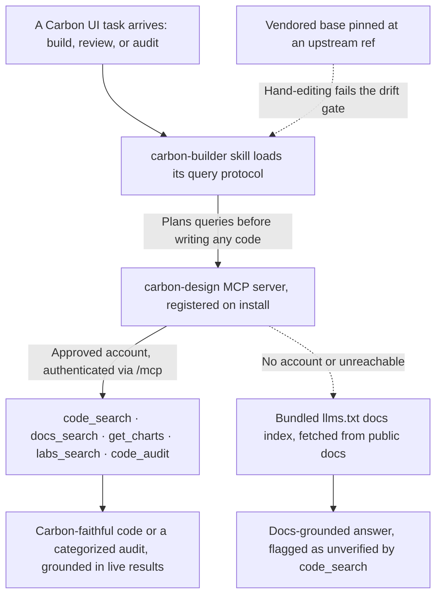

# carbon-builder

Codex uses the available Carbon MCP tool names and client connection controls; an approved Carbon account remains a prerequisite.

IBM Carbon Design System expertise: component code, variants, and props for Carbon React
and Web Components (Core + IBM Products), Carbon Charts, icons and pictograms, design
tokens and IBM Plex, accessibility guidance, AI Chat integration, and code-compliance
audits — grounded in the hosted Carbon MCP server rather than model memory.

## How it fits together



## When it triggers

Building, reviewing, or auditing Carbon UI code; asking how a Carbon component, token,
grid, or pattern is meant to be used; generating Carbon-faithful code with the
`carbon-design` MCP server this plugin registers.

## Access

The hosted server requires an **IBM-approved account** — authenticate through the current client's connection controls after
install; request approval at <https://mcp.carbondesignsystem.com>. Unapproved sessions
still get the skill's protocol knowledge and the public-docs fallback. The server URL is
a literal in the spec (not `${ENV}`) deliberately: it is IBM's single public deployment,
the same for every consumer, and carries no credential.

## Attribution

The `base/` directory is the **`carbon-builder` skill** from IBM's Carbon MCP project,
vendored verbatim:

- Source: <https://github.com/carbon-design-system/carbon-mcp>, path
  `public/skills/carbon-builder`
- Pinned ref: `3cbe743d8bc36d6dd3bcfea98ac3ac09bca71f9c`
- License: Apache-2.0, declared by the author in the skill's own frontmatter (the
  upstream repo ships no LICENSE file) — the canonical Apache-2.0 text is included here
  as `LICENSE` to satisfy that declaration's redistribution terms.

The public-docs references have a separate licensed source:

- Source: [carbon-website at `996791935ba9edc7977fc12d7b16548181402c14`](https://github.com/carbon-design-system/carbon-website/tree/996791935ba9edc7977fc12d7b16548181402c14).
- `references/carbon-llms.txt` is byte-identical to that revision's `static/llms.txt`
  (also copied as `public/llms.txt` in carbon-mcp at the pin above).
- `references/prompting.md` condenses `src/pages/developing/carbon-mcp/prompts.mdx`;
  examples and explanatory sections are omitted and guidance is reorganized.
- Copyright 2018 IBM Corp. Apache-2.0, under the website's
  [LICENSE](https://github.com/carbon-design-system/carbon-website/blob/996791935ba9edc7977fc12d7b16548181402c14/LICENSE).
  The full terms accompany this skill in its `LICENSE` file. No upstream NOTICE
  file exists at this website revision. These terms do not imply IBM endorsement.

Do not edit `base/` — update the pin instead (a new ref, re-vendored verbatim). A
hand-edit there registers as `diverged` against the pinned ref and fails the
vendored-drift gate.

## Install

```
claude plugin install carbon@dotfiles-agents
```

Since the decision-020 sweep the `carbon` plugin is this skill's only home — it used to
ship from `solo-skills` as well, which registered no Carbon MCP server for it.

## Codex

Discover MCP tools through the current client. Codex uses plugin connection controls or its MCP login command for a CLI registration; public-doc fallback uses the available page-fetch tool. No Claude runtime is required.
