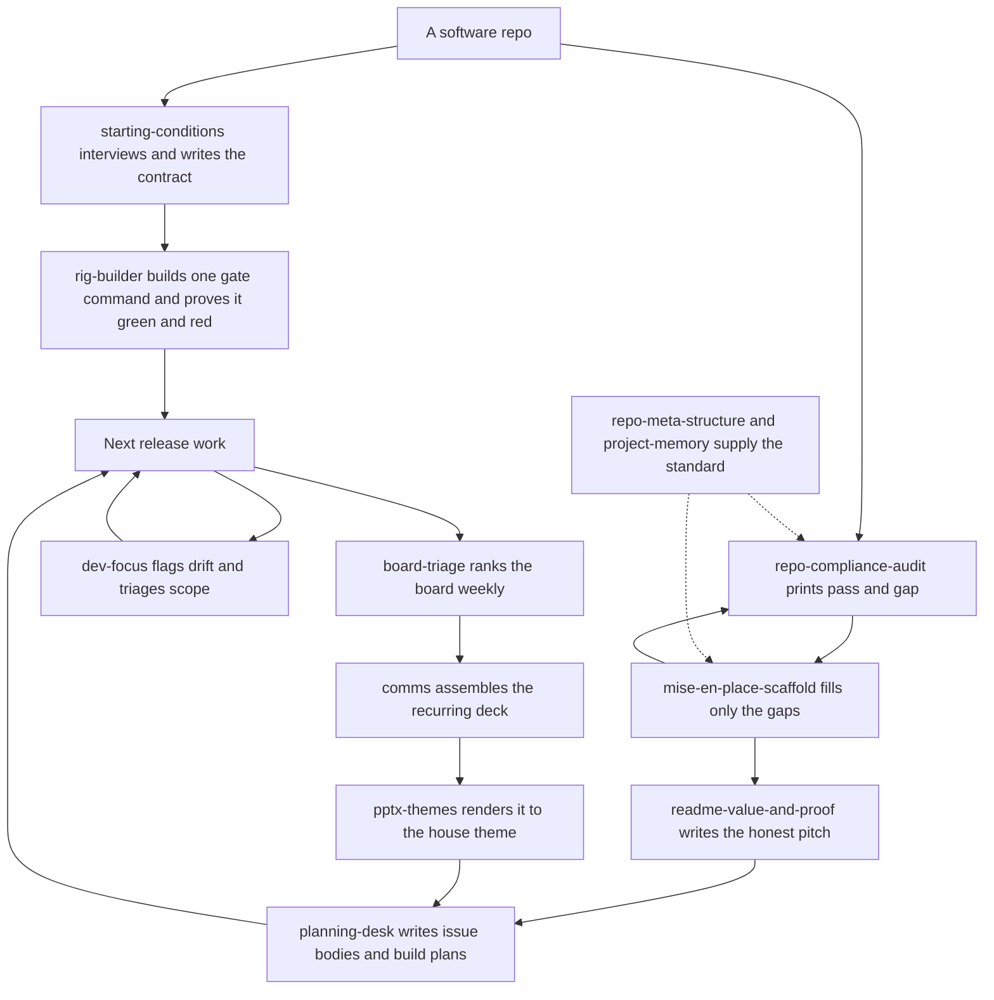

# code-desk

Bring a software repo to a documented meta-structure standard and run next-release work
through it — set the quality contract and the gate that enforces it, audit compliance,
scaffold what's missing, apply the repo-layout and memory standards, turn the README into an
honest value-and-proof pitch — and carry the executive-desk overhead for running that work
end-to-end: a source-grounded planning desk, recurring status comms, weekly board triage,
and the themed decks those comms ship as.

## How it fits together

A repo enters two ways: `starting-conditions` decides what the machine will enforce and
`rig-builder` turns that into one gate command, while the audit and the scaffold are a
tight loop you run until the layout gaps close. Everything after is the release loop those
unlock. Dashed edges are reference content the other skills read rather than steps you run.



## What you get

| Skill | What it does |
|---|---|
| `starting-conditions` | Interview-first. Decides what is being built, in what language, and which rules a machine enforces, then writes a `RULES.md` contract, one gate command that proves it, and the baseline of what that gate says about the tree today. Measures; never remediates. |
| `repo-compliance-audit` | Read-only. Prints a pass/gap table (`ID \| Area \| Verdict \| Detail`) against the repo-meta-structure and memory-taxonomy standards, plus a `N pass / M gap` summary. Never writes to the repo it audits. |
| `mise-en-place-scaffold` | Fill-only. `--plan` (default) shows exactly what it would create for the gaps the audit found and writes nothing; `--apply` creates only those items. Never overwrites, edits, or deletes anything that already exists. |
| `repo-meta-structure` | Reference content: the canonical directory taxonomy, `.claude`/`.github` layout, and gitignore conventions the audit checks against and the scaffold builds from. |
| `project-memory` | The memory taxonomy and the tooling that realizes it — where agent memory lives (global vs. project-level), memory vs. rules vs. skills, and when a fact is worth promoting up a layer, plus opting a repo into tracked, in-repo auto-memory (wires `.claude/memory/` as the memory directory; never overwrites) and recovering memory after a folder move (dry-run by default). Pure Python 3 stdlib. |
| `readme-value-and-proof` | Turns a README into an honest pitch — what a user gets, backed by real screenshots captured from the running app, not mockups. |
| `dev-focus` | A mid-session focus check that flags drift from the original task, and a scope triage that sorts a task list into MUST/DEFER/CUT. |
| `planning-desk` | Stands up a source-grounded planning desk under `_meta/plans/` — write conformant issue bodies and deep build plans, driven through a draft → review → fix → reconcile loop. |
| `board-triage` | The weekly routine that ranks the un-ranked items on a task board so its prioritization and roadmap views stay useful instead of drifting into noise. The Impact×Effort judgment is backend-agnostic; a thin adapter does the board's I/O (GitHub Projects v2 and Kaneo ship). |
| `comms` | Produces recurring status deliverables — a morning briefing, end-of-day wrap-up, weekly planning briefing, board readout, or product overview — as a deck, to one consistent standard. |
| `pptx-themes` | Builds the decks `comms` ships as, with a curated theme layer — semantic theme tokens, approved color palettes, monospaced typography, and a visual-QA workflow — composed over Anthropic's vendored pptx base skill. |

The bundle also ships an agent: `rig-builder`, which `starting-conditions` dispatches once
the contract exists to scaffold the gate, prove it fails when a rule is broken, and report
the baseline.

## Also installable on their own

Several of these skills are useful outside the desk and ship as standalone plugins too —
`comms`, `mise-en-place-scaffold`, `pptx-themes`, `project-memory`, `readme-value-and-proof`,
and `repo-meta-structure`. Install one directly when you want it without the rest of the bundle:

```
claude plugin install repo-meta-structure@dotfiles-agents
```

Each is the same skill, not a copy: the bundle and the standalone plugin both point at one
source, so they ship identical bytes. The rest (`starting-conditions`,
`repo-compliance-audit`, `dev-focus`, `planning-desk`, `board-triage`) stay bundle-only;
they assume the desk's other pieces and don't stand alone cleanly.

## A worked example

```
You: "run the compliance audit"
→ repo-compliance-audit prints, e.g.:
    ID      | Area          | Verdict | Detail
    META-01 | _meta/ layout | gap     | HANDOFF.md missing
    MEM-02  | memory dir    | gap     | no tracked memory/ directory
    ...
    7 pass / 2 gap

You: "scaffold this repo"
→ mise-en-place-scaffold's --plan shows exactly those 2 gapped items and nothing else;
  --apply creates only those — every file that already existed is left untouched.

Re-run the audit → both gaps are now passes.

Later: "write me a real README for this"
→ readme-value-and-proof captures live screenshots of the app actually running and
  writes the value-proposition pitch around them — not a description of planned features.

You: "plan this out"
→ planning-desk writes a conformant issue body or a deep build plan under _meta/plans/,
  grounded in cited source, stated as deliverables/criteria/parallelism — never a timeline.

Later: "run board triage"
→ board-triage exports the board snapshot, finds the un-ranked/blank/stale items, ranks
  them by the standing Impact×Effort rubric, and applies only the diffs through the
  adapter for whatever board you run.

End of week: "produce the weekly planning briefing"
→ comms assembles the deck from the same sources the planning desk and board already
  track, to the standard's format — no one-off slide deck from scratch.
→ pptx-themes renders it: the approved palette, monospaced type, and a visual-QA pass
  before it ships, instead of the generic pptx skill's defaults.
```

## Honest scope

Almost everything here is additive or read-only by design — nothing in this bundle merges,
deletes, or force-overwrites existing content. `mise-en-place-scaffold` reports a conflict
instead of resolving it when a file already exists but doesn't match the expected shape; a
human (or a separate, deliberate edit) still makes that call. The executive-desk skills
assume a repo, a planning-desk `_meta/plans/` tree, and (for `board-triage`) a board
already stood up with an adapter for it — they operate on those directly rather than
replacing them. `starting-conditions` and its `rig-builder` agent are the one place that
edits an existing file on purpose: proving a gate can fail means breaking one rule in the
tree, watching the gate catch it, and reverting the sabotage. Neither fixes what the
baseline finds, because writing the contract and satisfying it are separate jobs and a
baseline taken after remediation is worthless. `board-triage`'s GitHub Projects adapter
drives scripts that ship in the `solo-skills` bundle, so that backend needs both installed;
its Kaneo adapter does not. `pptx-themes` is a themed layer over Anthropic's vendored
`pptx` base skill, not a full authoring replacement for it.
