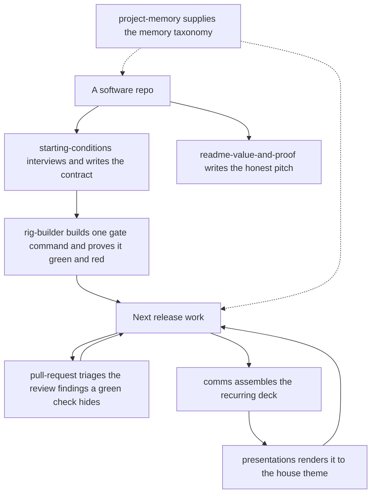

# code-desk

The shared hook library carries the Codex session-handoff transaction helper and guarded
nested-worktree retirement notice; both policies are activated through Atelier, not through
code-desk's hooks.
Parallel activity may proceed after invalidation; the helper alone requires sequential certification.

Codex can use the project-memory taxonomy and maintain a Claude memory setup. The project-memory scripts configure Claude Code, not native Codex memory.

Set the quality contract a repo is held to, build the one gate command that enforces it, and
run next-release work through it — plus the executive-desk overhead around that work: the
review findings a green check hides, recurring status comms, the themed
decks those comms ship as, an honest value-and-proof README, and the memory taxonomy the repo
keeps.

The in-repo `_meta/` planning system that used to live here — the layout standard, the
compliance audit, the scaffold, and the planning desk — now ships as the separate
[`mise-en-place`](../mise-en-place/README.md) plugin, whose desk runs over a tracker adapter
while its layout standard, audit, and scaffold still assume the repo tree is the system of
record.

## How it fits together

A repo enters one way: `starting-conditions` decides what the machine will enforce, and
`rig-builder` turns that into one gate command proven both green and red. Everything after
is the release loop that gate unlocks. Dashed edges are reference content other skills read
rather than steps you run.



## What you get

| Skill | What it does |
|---|---|
| `starting-conditions` | Interview-first. Decides what is being built, in what language, and which rules a machine enforces, then writes a `RULES.md` contract, one gate command that proves it, and the baseline of what that gate says about the tree today. Measures; never remediates. |
| `comms` | Produces recurring status deliverables — a morning briefing, end-of-day wrap-up, weekly planning briefing, board readout, or product overview — as a deck, to one consistent standard. |
| `presentations` | Builds the decks `comms` ships as, with authored semantic palettes, typography, portable PptxGenJS sources, existing-deck editing and rendered visual verification. |
| `readme-value-and-proof` | Turns a README into an honest pitch — what a user gets, backed by real screenshots captured from the running app with Playwright, not mockups. No machine-local helpers. |
| `pull-request` | The pass that runs after the checks go green: collect a PR's inline review comments, its review and summary comments, and its gate statuses, then classify each finding as actionable (it sits on a line this PR changed, or it is a failing hard gate) or as pre-existing rot named as deferred rather than dropped. |
| `project-memory` | The memory taxonomy and the tooling that realizes it — where agent memory lives (global vs. project-level), memory vs. rules vs. skills, and when a fact is worth promoting up a layer, plus opting a repo into tracked, in-repo auto-memory (wires `.claude/memory/` as the memory directory; never overwrites) and recovering memory after a folder move (dry-run by default). Pure Python 3 stdlib. |

The bundle also ships an agent: `rig-builder`, which `starting-conditions` dispatches once
the contract exists to scaffold the gate, prove it fails when a rule is broken, and report
the baseline. It declares a semantic dispatch **tier** (`mid`) rather than a model name; which
model a tier buys is resolved from one shared map, so a provider change does not touch this
bundle.

And one command:

| Command | What it does |
|---|---|
| `/pr-findings [<n>]` | Loads `pull-request` and drives it over one PR — the current branch's open PR when no number is given. |

Per-skill plugins have been retired. The members that stand alone — `presentations`,
`project-memory`, `readme-value-and-proof` — ship only from this bundle. `project-memory`
ships in `mise-en-place` as well, whose audit and scaffold read its checklist off their own
plugin root and cannot run without it. `comms` and `pull-request` do not: this desk is their
topical plugin, so it is the only bundle that carries them (decision-020).

## A worked example

```
You: "set this repo's starting conditions"
→ starting-conditions interviews you, writes RULES.md, and defines one gate command;
  rig-builder then builds that gate, breaks one rule on purpose to watch it fail, reverts
  the sabotage, and reports the baseline the gate gives on the tree as it stands.

After the checks go green: "what did the review actually find?"
→ pull-request collects the inline comments, reviews, and gate statuses, and splits what
  sits on a line this PR changed from pre-existing rot named as deferred.

Later: "write me a real README for this"
→ readme-value-and-proof captures live screenshots of the app actually running and
  writes the value-proposition pitch around them — not a description of planned features.

End of week: "produce the weekly planning briefing"
→ comms assembles the deck from the same sources the board already tracks, to the
  standard's format — no one-off slide deck from scratch.
→ presentations renders it: the approved palette, deliberate typography, and a visual-QA pass
  before it ships, instead of the generic pptx skill's defaults.
```

## Honest scope

`starting-conditions` and its `rig-builder` agent are the one place that edits an existing
file on purpose: proving a gate can fail means breaking one rule in the tree, watching the
gate catch it, and reverting the sabotage. Neither fixes what the baseline finds, because
writing the contract and satisfying it are separate jobs, and a baseline taken after
remediation is worthless.

Board triage and GitHub mirror reconciliation now ship in
[`board-desk`](../board-desk/README.md). Install it for that maintenance loop.

`comms` writes its dated briefing folders to `_meta/briefings/` when the repo already
carries a `_meta/` tree, and falls back to `briefings/` at the repo root when it does not —
it never creates the wider meta-structure to get there. That is the default, not the only
answer: a `briefings_dir` key in `.claude/comms.local.md` redirects the output for a project
that follows neither convention, and `deliver.py briefings-dir <project>` prints what the
chain resolved to.

`presentations` replaces and renames `pptx-themes`; the vendored Anthropic base is removed.
Its portable source packages retain direct PptxGenJS authoring and the existing authored
palettes. Independent ZIP/XML tools support inspection, exact text edits, selection and
merge; rendering supplies PDF, slide images and a contact sheet. Full XSD conformance
is outside the replacement's structural validator. See the skill's migration and editing
references for supported features and runtime dependency limitations.

## Install

```
claude plugin install code-desk@dotfiles-agents
```

Since the decision-020 sweep this bundle is the only home for `presentations` and
`readme-value-and-proof`, and the topical owner of `project-memory`, which also ships in
`mise-en-place`. All three used to ship from `solo-skills` as well, and no longer do.

## Codex

Install with `codex plugin add code-desk@dotfiles-agents`. Use Python 3.11 or newer to generate this package’s
project roles with the shared Codex helper from its installed root (the path returned by `codex plugin add --json`):

```sh
python3 "$PLUGIN_ROOT/hooks/_lib/codex_roles.py" /path/to/project --plugin-root "$PLUGIN_ROOT"
```

Start a fresh session and trust the package hooks in `/hooks`. The native `worker-context` and `worktree-isolation` hooks inject
canonical role instructions and enforce each role’s dispatch and patch-tool exclusions.
These roles run without an Atelier activation file. Install Atelier separately for worktree
isolation; shell access remains subject to the role’s instructions and the project sandbox. Setup preserves user-edited profiles and uses the shared OpenAI model tiers.
When Atelier is installed, run its project setup after generating these roles. It reconciles
policy into the sole configured agent's native directory or `.agents/atelier.local.md` when
multiple coding agents are configured; this bundle ships the same policy-selection helpers, including the shared activation-file reader.
Invoke the `pull-request` skill for the `/pr-findings` workflow; the Claude command itself is not a native Codex command.

The shared catalog reserves Astra/Fable for the root strategist; heavy Codex subagents resolve
to Sol, mid to Terra, and light to Luna. Refresh owned profiles after upgrading to apply the map.
