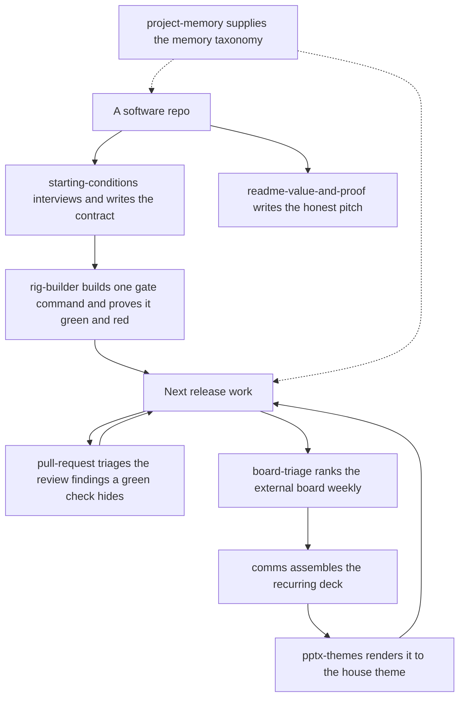

# code-desk

Set the quality contract a repo is held to, build the one gate command that enforces it, and
run next-release work through it — plus the executive-desk overhead around that work: the
review findings a green check hides, weekly board triage, recurring status comms, the themed
decks those comms ship as, an honest value-and-proof README, and the memory taxonomy the repo
keeps.

The in-repo `_meta/` planning system that used to live here — the layout standard, the
compliance audit, the scaffold, and the planning desk — now ships as the separate
[`mise-en-place`](../mise-en-place/README.md) plugin, whose desk runs over a tracker adapter
while its layout standard, audit, and scaffold still assume the repo tree is the system of
record.

## How it fits together

A repo enters one way: `starting-conditions` decides what the machine will enforce, and
`rig-builder` turns that into one gate command proven both green and red. Everything after
is the release loop that gate unlocks. Dashed edges are reference content other skills read
rather than steps you run.



## What you get

| Skill | What it does |
|---|---|
| `starting-conditions` | Interview-first. Decides what is being built, in what language, and which rules a machine enforces, then writes a `RULES.md` contract, one gate command that proves it, and the baseline of what that gate says about the tree today. Measures; never remediates. |
| `board-triage` | The weekly routine that ranks the un-ranked items on a task board so its prioritization and roadmap views stay useful instead of drifting into noise. The Impact×Effort judgment is backend-agnostic; a thin adapter does the board's I/O (GitHub Projects v2, Kaneo, and Kata ship). |
| `comms` | Produces recurring status deliverables — a morning briefing, end-of-day wrap-up, weekly planning briefing, board readout, or product overview — as a deck, to one consistent standard. |
| `pptx-themes` | Builds the decks `comms` ships as, with a curated theme layer — semantic theme tokens, approved color palettes, monospaced typography, and a visual-QA workflow — composed over Anthropic's vendored pptx base skill. |
| `readme-value-and-proof` | Turns a README into an honest pitch — what a user gets, backed by real screenshots captured from the running app, not mockups. |
| `pull-request` | The pass that runs after the checks go green: collect a PR's inline review comments, its review and summary comments, and its gate statuses, then classify each finding as actionable (it sits on a line this PR changed, or it is a failing hard gate) or as pre-existing rot named as deferred rather than dropped. |
| `project-memory` | The memory taxonomy and the tooling that realizes it — where agent memory lives (global vs. project-level), memory vs. rules vs. skills, and when a fact is worth promoting up a layer, plus opting a repo into tracked, in-repo auto-memory (wires `.claude/memory/` as the memory directory; never overwrites) and recovering memory after a folder move (dry-run by default). Pure Python 3 stdlib. |

The bundle also ships an agent: `rig-builder`, which `starting-conditions` dispatches once
the contract exists to scaffold the gate, prove it fails when a rule is broken, and report
the baseline.

And one command:

| Command | What it does |
|---|---|
| `/pr-findings [<n>]` | Loads `pull-request` and drives it over one PR — the current branch's open PR when no number is given. |

Per-skill plugins have been retired: the members that stand alone outside this desk —
`comms`, `pptx-themes`, `project-memory`, `readme-value-and-proof` — ship individually in the
`solo-skills` bundle instead, from the same source, so the bytes are identical either way.

## A worked example

```
You: "set this repo's starting conditions"
→ starting-conditions interviews you, writes RULES.md, and defines one gate command;
  rig-builder then builds that gate, breaks one rule on purpose to watch it fail, reverts
  the sabotage, and reports the baseline the gate gives on the tree as it stands.

After the checks go green: "what did the review actually find?"
→ pull-request collects the inline comments, reviews, and gate statuses, and splits what
  sits on a line this PR changed from pre-existing rot named as deferred.

Later: "write me a real README for this"
→ readme-value-and-proof captures live screenshots of the app actually running and
  writes the value-proposition pitch around them — not a description of planned features.

Later: "run board triage"
→ board-triage exports the board snapshot, finds the un-ranked/blank/stale items, ranks
  them by the standing Impact×Effort rubric, and applies only the diffs through the
  adapter for whatever board you run.

End of week: "produce the weekly planning briefing"
→ comms assembles the deck from the same sources the board already tracks, to the
  standard's format — no one-off slide deck from scratch.
→ pptx-themes renders it: the approved palette, monospaced type, and a visual-QA pass
  before it ships, instead of the generic pptx skill's defaults.
```

## Honest scope

`starting-conditions` and its `rig-builder` agent are the one place that edits an existing
file on purpose: proving a gate can fail means breaking one rule in the tree, watching the
gate catch it, and reverting the sabotage. Neither fixes what the baseline finds, because
writing the contract and satisfying it are separate jobs, and a baseline taken after
remediation is worthless.

`board-triage` assumes a board already stood up with an adapter for it. Every adapter is
self-contained in this bundle, and what each needs is the backend's own client: `gh`
authenticated with `project` scope for GitHub Projects, the `kata` CLI on PATH already pointed
at the right daemon for Kata, the API url/key/project env values for Kaneo. Every adapter
also answers `apply` the same way: a row it cannot resolve prints as a `SKIP` on stderr and
exits non-zero, while the rows that did resolve are still applied — so `apply || abort`
means one thing on all three backends.

`comms` writes its dated briefing folders to `_meta/briefings/` when the repo already
carries a `_meta/` tree, and falls back to `briefings/` at the repo root when it does not —
it never creates the wider meta-structure to get there.

`pptx-themes` is a themed layer over Anthropic's vendored `pptx` base skill, not a full
authoring replacement for it — and it names where to report an error in that base, since the
vendored copy is never hand-edited.

## Install

```
claude plugin install code-desk@dotfiles-agents
```
