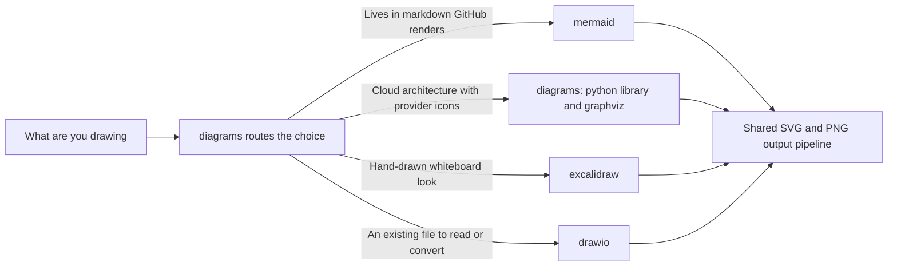

# diagrams

Structural diagrams for repo docs, decks, and architecture briefings — one toolkit that
picks the right tool for the job and feeds consistent SVG+PNG output pipelines with
light/dark-friendly styling.

## How it fits together

Picking the tool is the actual problem, so that is what the picture draws. The `diagrams`
skill is the hub that routes you; whichever tool you land on, the output pipeline is shared.



## What you get

| Skill | What it does |
|---|---|
| `diagrams` | The hub — structural-diagram tool selection, cloud-architecture diagrams with provider icons via Python's `diagrams` library (Azure first), raw Graphviz dot for dependency graphs and trees, and the output pipelines the other skills feed. |
| `mermaid` | Mermaid for GitHub-rendered markdown — flowcharts, sequence diagrams, ERDs, and state diagrams, with the house rule that node labels carry no parentheses or special characters, light/dark theming, and mermaid-cli rendering to SVG/PNG. |
| `drawio` | Read, convert, and headlessly export draw.io / diagrams.net files — compressed and uncompressed mxGraph XML, a stdlib Python decompression recipe, legacy-to-Mermaid conversion, and desktop-app CLI export to PNG/SVG. |
| `excalidraw` | Sketch-style architecture diagrams as `.excalidraw` files — uses the Excalidraw MCP tools when a session exposes them, otherwise authors the scene JSON directly (schema, arrow binding, labels), with SVG/PNG export guidance. |

## Install

```
claude plugin install diagrams@dotfiles-agents
```

## Honest scope

Structural diagrams only: data charts belong to a dataviz skill, deck theming to
`pptx-themes`. The cloud-architecture and Graphviz paths need `graphviz` installed
(`cli:graphviz`); headless draw.io export needs the draw.io desktop app (`cli:drawio`);
Mermaid renders natively on GitHub without any local install.
