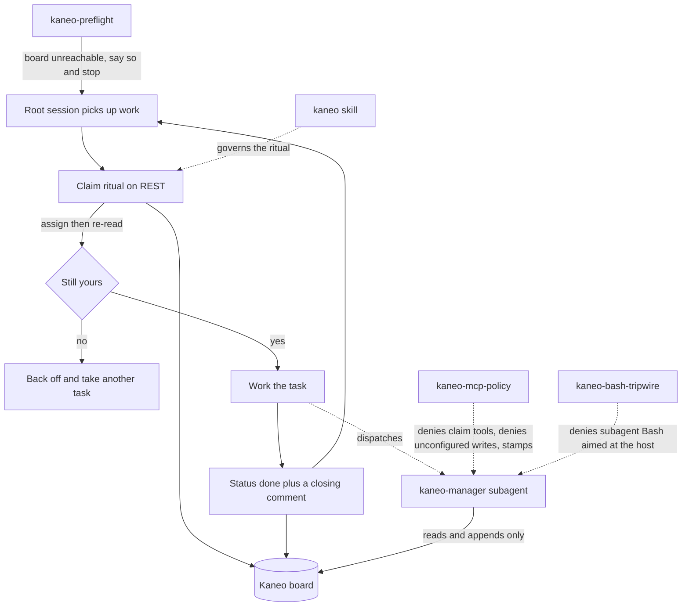

# kaneo

Track a repo's work on a live [Kaneo](https://github.com/usekaneo/kaneo) board instead of
in-repo task files. Parallel agent sessions and a `TODO.md` do not mix: the list drifts per
branch, two sessions grab the same work, and nothing records who did what. A shared board
fixes the drift — but a root session spawning managers spawning workers creates two new
problems, because every level shares one process environment and therefore holds the same
credentials, and parallel subagents sharing one identity break the board's only race
protection.

This plugin is the answer to both: per-level tool grants, a policy hook that enforces the
floor rather than trusting an agent's own `tools:` list, and automatic attribution on
everything that lands.

Install it in any repo whose work is tracked on a Kaneo project. Nothing about an instance
is baked in — all five instance values arrive as `KANEO_*` env vars.

## How it fits together



The claim ritual is the load-bearing part: there is no atomic claim, so assign-then-re-read
is the entire race protection. It runs on REST from the root session only, because MCP's
lone assignee path is a full-object read-merge-write that can silently revert the GitHub
integration's push-driven status transition.

## What you get

| Path | What it does |
|---|---|
| `skills/kaneo/` | The contract: claim ritual, levels, decision convention, plus configuration, API, and access-model references |
| `.mcp.json` | The board's MCP server, registered by installing the plugin — no hand-written config in the consuming repo |
| `agents/kaneo-manager.md` | Reference L2 manager; its `tools:` list *is* the append-only allowlist |
| `hooks/kaneo-preflight/` | Says at session start that the board is unreachable and which cause it is — or that the tools work but under the wrong identity |
| `hooks/kaneo-mcp-policy/` | Floor-deny for subagents, deny on unconfigured board writes, attribution stamping |
| `hooks/kaneo-bash-tripwire/` | Advisory deny on subagent Bash that reaches the board host directly |

## Failing loudly when the tools are not there

**Enabling this plugin is a declaration that this repo's work lives on a Kaneo board.** So
there are two supported states, and no quiet third one: configured and working, or turned
off. Enabled-but-broken gets complained about at the start of every session until you fix
the configuration or disable the plugin. That is deliberate — the alternative is a session
that believes it has board tools it does not have.

Installing a plugin's MCP server is not the same as having it. Three things switch it off
without a word: the repo is unconfigured, someone ran `/mcp disable` here (per-project, and
recorded only in `~/.claude.json`), or `CLAUDE_CODE_SKIP_PLUGIN_MCP_SERVERS` is set. In all
three the skill still loads, still says the board holds the work, and still forbids
`TODO.md` — so an agent that finds no board tools improvises rather than stopping.

There is also a quieter version. The MCP server expands only `KANEO_API_URL` and
`KANEO_MCP_TOKEN`, but the workflow needs all five variables. Set just those two and the
board tools are fully present with no project id and no identity: nothing errors, and the
agent picks a board. `kaneo-preflight` catches the first three at session start;
`kaneo-mcp-policy` denies the fourth at the moment of the call, naming the variable to set.
The diagnostic tools — `whoami`, `list_workspaces`, `list_projects` — stay open throughout,
because denying the diagnostic turns a loud failure back into a confusing one.

And the quietest one of all, where everything works. A server *also* named `kaneo`
registered directly in `~/.claude.json` outranks the plugin's. If it carries no
`Authorization` header, Claude Code falls back to interactive OAuth and the browser consent
authenticates **the human owner**, not the repo's agent — so every tool call succeeds under
the wrong name and every claim comment is misattributed. `kaneo-preflight` reports this
separately from the unreachable cases, because "board NOT available" is the wrong thing to
read while the tools sit right there working.

## Levels, and the ceiling

Board authority narrows down the delegation chain: the root session claims and mutates,
L2 managers read and append but never claim or change status, L3 workers get no board tools.
The hook enforces the L2 floor rather than trusting an agent's `tools:` list, so a
misconfigured agent fails closed.

**Enforcement is sound for MCP calls only.** Both credentials live in the shared process
environment, so any subagent holding Bash can reach the board over REST regardless — the
tripwire catches the naive path and leaves a trail, nothing more. For a single-owner
self-hosted instance that ceiling is accepted; do not describe this plugin as containment.
`skills/kaneo/references/access-model.md` states the limit precisely.

## Install

```
claude plugin install kaneo@dotfiles-agents
```

Then configure the repo — `skills/kaneo/references/configuration.md` lists the five
variables, where each comes from, and the 30-day token expiry that later looks like a
broken install. A missing value stops work rather than writing to the wrong board.
