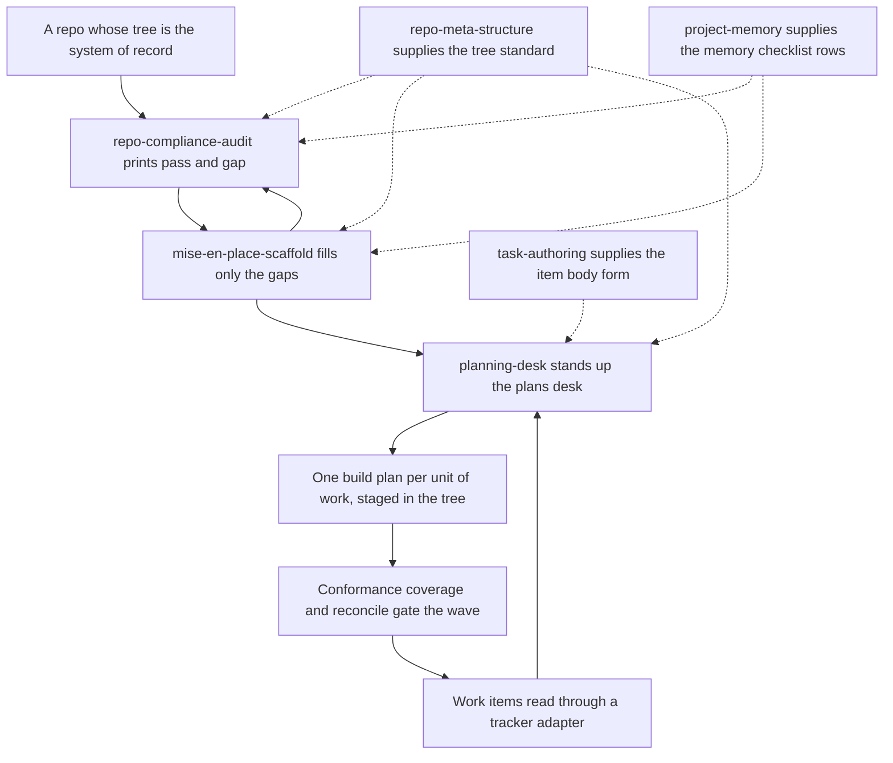

# mise-en-place

Codex and Claude Code use the same audit and scaffold helpers. Pass the installed package path explicitly with `--plugin-root`.

An in-repo planning system built on `_meta/`: a documented directory standard, a memory
taxonomy beside it, a read-only audit against both, an additive-only scaffolder, and a
planning desk that holds one build plan per unit of work as a file you review before anything
ships, written against a shared item-body standard.

The standards, the audit, and the scaffold prescribe artifacts that live in the repo tree, so
install them where the tree is the intended system of record; on a repo that keeps its
structure somewhere else they just add a second, silently diverging set of prescriptions. The
desk is the exception - it reads work items from a tracker through a pluggable adapter, and a
Kata adapter ships.

## How it fits together

The standards are reference content, not steps you run: `repo-meta-structure` says what the
tree must look like, `project-memory` says what `.claude/memory/` must look like, and the
audit and the scaffold read both — the audit's `MEM-xx` rows come out of `project-memory`'s
checklist, and neither script will start without that file on the plugin root. Audit and
scaffold are a tight loop you repeat until the gaps close; the planning desk is what you run
on the structure once it exists, against whatever tracker the adapter resolves, and it hands
the shape of a tracker item's body to `task-authoring` rather than restating it.



## What you get

| Skill | What it does |
|---|---|
| `repo-meta-structure` | Reference content, read by the audit, the scaffold, and the desk alike. Defines the `_meta/{_archive,briefings,plans,operations,research}/` taxonomy, `_meta/HANDOFF.md`, the `_meta/mise-en-place.yml` variance manifest, the `.claude/` and `.github/` layout, required root files, and the gitignore conventions. Answers "what is the standard for X" from the reference files, never from memory. A couple of checklist rows illustrate their pass condition with this repo's own worked-example paths (its ADRs), so consult a row's actual `Check` column for the checkable rule, not its narrative `Detail` text, when auditing a different repo. |
| `project-memory` | The second standard this bundle reads, and the reason both scripts can run at all. Defines the `.claude/memory/` taxonomy and owns the `MEM-xx` checklist rows the audit reports and the scaffold fills; `audit.py` and `scaffold.py` each load `skills/project-memory/references/checklist.md` off the plugin root and abort if it is absent, so it ships here rather than being assumed present. Its own bundled scripts wire and migrate a repo's memory directory; it never issues a verdict. |
| `repo-compliance-audit` | Read-only. Runs one bundled script from the repo root and presents its `ID \| Area \| Verdict \| Detail` table plus the `N pass / M gap` summary verbatim. Never writes to the audited repo, never fixes a gap, and defines no checks of its own — every row comes from a standard's checklist. |
| `mise-en-place-scaffold` | Fill-only. `--plan` is the default and writes nothing: it shows the creations, conflicts, and manual items per checklist ID. `--apply` creates only those planned items. There is no overwrite mode — a file that differs from a template is reported as a conflict with a diff and left byte-identical. |
| `planning-desk` | Stands up `_meta/plans/`: a `_config.md` for this repo's gates and tracker binding, a tracker adapter plus three dependency-free analysis scripts under `_utils/`, and a folder per unit of work holding `plan.md`. Tracker-adapter-backed, with a Kata adapter shipped — the tracked item is the contract, the plan is the build detail, and the scripts are generated views over a tracker snapshot plus disk. It also carries the MUST/DEFER/CUT scope hammer, the one move that needs neither desk nor tracker: a candidate list triaged into a table, biased toward deferring or cutting. |
| `task-authoring` | The item-body standard the desk delegates to, carried here as a dependency from its topical home in `board-desk`. The desk owns the plan; what a tracker item's own body must contain — a title that scans and carries no `word: ` prefix (area and type live in labels), acceptance criteria that can fail, thresholds given as a number or a command, a mechanism behind every gate, and stated scope ownership — is defined here, and the desk points at it rather than restating it. `_utils/conformance.py` is a coarser instrument over the same material: it looks for named headings, so an item can satisfy this standard and still be flagged for want of one. Write to the standard; read the script as triage. |

One legacy carve-out survives in both the audit and the scaffold: the frontmatter checks over
`_meta/plans/` skip `issue-body.md`. That exemption covered a staged body kept byte-identical
to the live tracked item; `planning-desk` no longer stages one, so only desks predating the
tracker-adapter change still carry the file.

## Honest scope

The desk reads a tracker through an adapter and does not care which one, but only **one
adapter ships** (Kata); a second backend means writing one against the snapshot contract in
the skill's `references/adapters/contract.md`. The tree-bound half of the plugin - the
`_meta/` standard, the memory standard, the audit, the scaffold - is still for repos where the
tree is the system of record, which is why these skills are isolated in their own plugin
rather than folded into a general bundle.

Everything is additive or read-only by design. The audit never writes to the repo it
audits. The scaffold never overwrites, merges, edits, deletes, or moves an existing file,
and never runs `git add` or `git commit` — you review the plan, you apply, you commit.
Conflicts are reported for a human to resolve, not resolved automatically.

Per-repo variance belongs in `_meta/mise-en-place.yml`, never as a silent exception to the
standard. If a repo legitimately deviates, record it there. Three of that manifest's fields —
`gh_issue_labels`, `gh_milestones`, `board_title` — are **declared, never provisioned**:
nothing in this marketplace creates them, so a consumer runs `gh label create` /
`gh api …/milestones` by hand. The declaration is there so the intended set is written down
and reviewable, not so a script will apply it.

One cross-plugin note: `comms` (in the `code-desk` bundle) writes its dated briefing
folders into `_meta/briefings/` when a repo carries this structure. It reads the layout but
does not require this plugin.

## Install

```
claude plugin install mise-en-place@dotfiles-agents
```

`task-authoring` is owned topically by [`board-desk`](../board-desk/README.md) and
remains here because the planning desk requires its item-body standard. Both assemblies
link to the same canonical skill. Enabling both plugins lists that skill twice.
`project-memory` is similarly carried here from its topical home in `code-desk`.
Neither skill ships from `solo-skills`.
