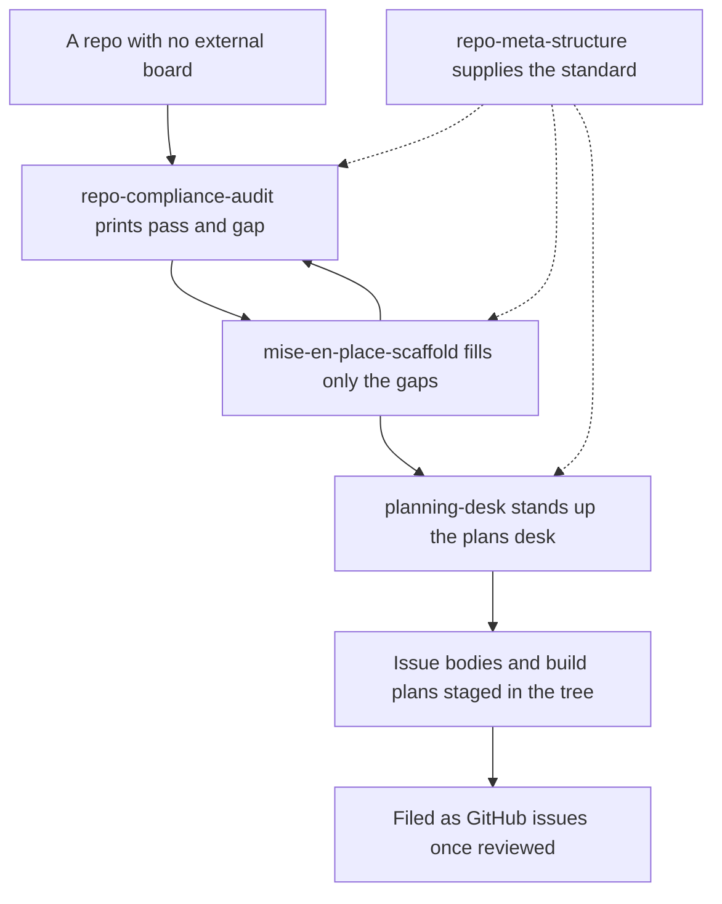

# mise-en-place

An in-repo planning system for repos that are **not** tracked on an external board. Every
artifact it prescribes lives in the repo tree, under `_meta/`: a documented directory
standard, a read-only audit against it, an additive-only scaffolder, and a planning desk
that stages GitHub issue bodies and build plans as files you review before they ship.

**Do not install it on a board-tracked repo.** If work for that repo is filed on kata,
Kaneo, Linear, or GitHub Projects, the board is the system of record and these
prescriptions fight it — you get a second, silently diverging queue in the tree. Install
this only where the repo itself is the intended system of record.

## How it fits together

The standard is reference content, not a step you run: the audit and the scaffold both
read it. Audit and scaffold are a tight loop you repeat until the gaps close; the planning
desk is what you run on the structure once it exists.



## What you get

| Skill | What it does |
|---|---|
| `repo-meta-structure` | Reference content, read by the other three. Defines the `_meta/{_archive,briefings,plans,operations,research}/` taxonomy, `_meta/HANDOFF.md`, the `_meta/mise-en-place.yml` variance manifest, the `.claude/` and `.github/` layout, required root files, and the gitignore conventions. Answers "what is the standard for X" from the reference files, never from memory. |
| `repo-compliance-audit` | Read-only. Runs one bundled script from the repo root and presents its `ID \| Area \| Verdict \| Detail` table plus the `N pass / M gap` summary verbatim. Never writes to the audited repo, never fixes a gap, and defines no checks of its own — every row comes from a standard's checklist. |
| `mise-en-place-scaffold` | Fill-only. `--plan` is the default and writes nothing: it shows the creations, conflicts, and manual items per checklist ID. `--apply` creates only those planned items. There is no overwrite mode — a file that differs from a template is reported as a conflict with a diff and left byte-identical. |
| `planning-desk` | Stands up `_meta/plans/`: a `_config.md` for this repo's gates and issue-template sections, seven dependency-free utility scripts under `_utils/`, and a folder per unit of work holding `issue-body.md` and `plan.md`. Explicitly GitHub-issue-backed — the issue body is the contract, the plan is the build detail, and the scripts are generated views over `gh` plus disk. |

## Honest scope

The desk assumes **GitHub issues**. It predates board tracking and its governance scripts
read `gh`; it has no kata or Kaneo adapter and is not getting one here. That is exactly why
these four skills are isolated in their own plugin: a board-tracked repo installing the
wider desk would absorb an in-repo planning system it does not want.

Everything is additive or read-only by design. The audit never writes to the repo it
audits. The scaffold never overwrites, merges, edits, deletes, or moves an existing file,
and never runs `git add` or `git commit` — you review the plan, you apply, you commit.
Conflicts are reported for a human to resolve, not resolved automatically.

Per-repo variance belongs in `_meta/mise-en-place.yml`, never as a silent exception to the
standard. If a repo legitimately deviates, record it there.

One cross-plugin note: `comms` (in the `code-desk` bundle) writes its dated briefing
folders into `_meta/briefings/` when a repo carries this structure. It reads the layout but
does not require this plugin.

## Install

```
claude plugin install mise-en-place@dotfiles-agents
```
