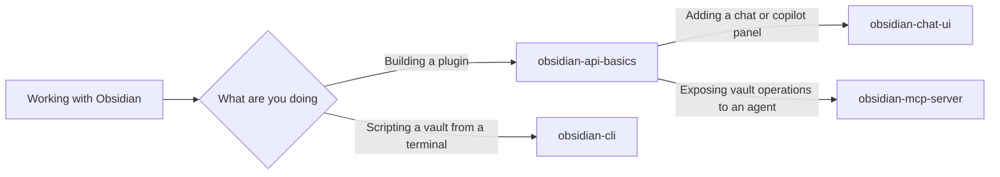

# obsidian-toolkit

Obsidian guidance in one separately toggleable plugin — build Obsidian plugins against the
real API surface, add chat/copilot UIs and in-plugin MCP servers, and automate vaults from
the terminal.

## How it fits together

Three of these are plugin-development skills and one is not. `obsidian-api-basics` is the
floor the other two build on — reach for it first, then the one matching what you are adding.
`obsidian-cli` is a separate path: it drives an existing vault and needs no plugin at all.



## What you get

| Skill | What it does |
|---|---|
| `obsidian-api-basics` | Foundational guidance for building Obsidian plugins — plugin lifecycle (onload/onunload), settings and saveData/loadData patterns, vault API operations, command registration, and ribbon icons. |
| `obsidian-chat-ui` | Patterns for chat and copilot-style interfaces in Obsidian plugins — ItemView sidebar panels, streaming message rendering, and workspace integration. |
| `obsidian-mcp-server` | MCP servers inside Obsidian plugins — Streamable HTTP transport setup and tool patterns that expose vault operations to AI agents. |
| `obsidian-cli` | The official Obsidian CLI (v1.12+) — interact with vaults, manage files, execute commands, and automate workflows from the terminal. |

## Install

```
claude plugin install obsidian-toolkit@dotfiles-agents
```

## Honest scope

Guidance skills, not a scaffolder: they teach the API surfaces, patterns, and gotchas with
worked examples, and assume a standard Obsidian plugin dev setup (TypeScript, esbuild).
`obsidian-cli` needs the Obsidian app's official CLI available on the machine
(`cli:obsidian`); the other three need only an editor and a vault to test in.
