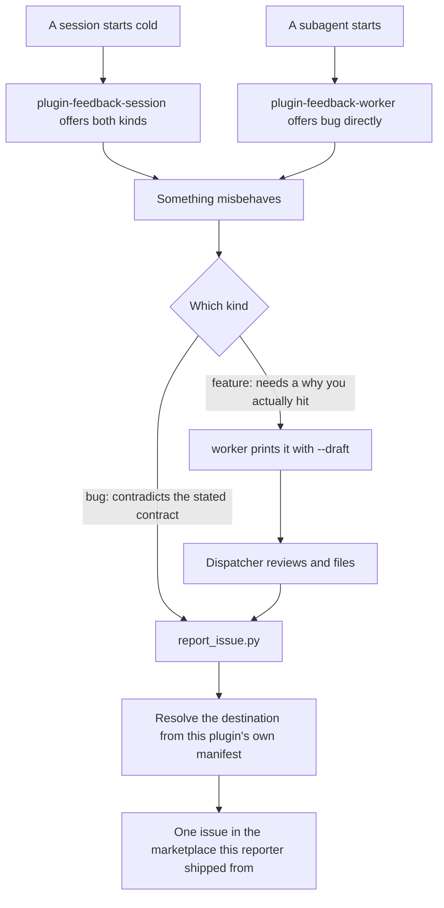

# plugin-feedback

A session that hits a defect in a plugin it is using usually works around it and moves on,
because filing the report is friction and nobody said reports were welcome. This plugin
removes both halves of that: reminder hooks say reports are welcome, and a reporter script
files one to a fixed shape so an agent never free-hands `gh issue create`.

Install it alongside whatever else you run from this marketplace. It ships on its own
rather than folded into every other plugin on purpose: Claude Code deduplicates a hook
handler only across settings-file layers, never across plugins, so a copy in each plugin
would fire the same nudge once per installed plugin.

```
claude plugin install plugin-feedback@dotfiles-agents
```

## How it fits together

The two hooks only make the offer; the reporter does the work. What splits the paths is who
noticed the defect and which kind it is — a bug is checkable against the plugin's own README,
a feature request needs a judgment a worker inside one slice cannot make.



## What it does

| Hook | Fires | Says |
|---|---|---|
| [`plugin-feedback-session`](hooks/plugin-feedback-session/README.md) | session start, cold only (`startup`/`clear`) | the primary session may file either a bug or a feature request |
| [`plugin-feedback-worker`](hooks/plugin-feedback-worker/README.md) | every subagent start | a worker may file a bug directly, but drafts a feature request for its dispatcher |

Both hooks inject a short pointer, not the template. The template lives in the reporter,
`hooks/plugin-feedback-session/report_issue.py`, which both hooks name by absolute path.

## What it reports on: this marketplace's plugins

**Issues go to the marketplace this reporter shipped from, never to the repo of the plugin
being reported.** The target is read from *this* plugin's manifest (or
`PLUGIN_FEEDBACK_REPO`), so it is fixed at install time and does not vary by which plugin
you are reporting on. A defect in a plugin you installed from somewhere else belongs in
that project's own tracker — filing it here just puts it in front of maintainers who
cannot fix it. Both hooks scope their offer accordingly.

The destination is never silent: the reporter prints the resolved repo and where it came
from before it files, and `--draft` prints the same line. Read it before you file.

```
Repo:  acme/widgets (from this plugin's own manifest)
Scope: this reporter files into the marketplace it shipped from, not the reported plugin's own repo
```

## The tier rule

A **bug** may be filed by anyone, worker included, because the bar is objective: *observed
behavior contradicts the plugin's own stated contract*. Checking it needs no judgment, only
the plugin's README.

A **feature request** needs a why tied to a limitation actually hit, which is a judgment
call a worker inside one slice is not positioned to make. So a worker runs the reporter with
`--draft`, prints the body, and hands it to its dispatcher to review and file.

## Filing one

```sh
python3 "${CLAUDE_PLUGIN_ROOT}/hooks/plugin-feedback-session/report_issue.py" bug \
  --plugin atelier --plugin-version 0.8.0 \
  --summary "worker covenant never injected under strict" \
  --symptom "No additionalContext arrives at subagent start." \
  --repro "Set enforce: strict, dispatch any subagent." \
  --contract "Its README states strict injects the covenant plus the tool-layer clause."
```

Add `--draft` to print the report instead of filing it. `feature` swaps `--contract` for
`--limitation`. Everything else (project, date, severity, workaround, suggested fix) has a
default or is optional; `--help` lists them.

`--severity` defaults to `minor`, the least severe of `blocker`/`major`/`minor`. Raise it
deliberately: an unconsidered report costs a maintainer one upgrade at read time, while a
queue where everything arrives `major` carries no priority signal at all.

## Configuration

Filing needs the `gh` CLI installed and authenticated against the target repo.

| Env var | Default | Meaning |
|---|---|---|
| `PLUGIN_FEEDBACK_REPO` | this plugin's manifest `repository` | Where every issue is filed, as `owner/name` — one destination, not per reported plugin |
| `PLUGIN_FEEDBACK_LABEL_BUG` | `type:fix` | Label applied to a bug |
| `PLUGIN_FEEDBACK_LABEL_FEATURE` | `type:feat` | Label applied to a feature request |
| `PLUGIN_FEEDBACK_DISABLED` | unset | Any non-empty value stands both reminders down |

No repo is hardcoded. With neither the variable nor a manifest `repository` resolvable, the
reporter refuses and names the variable rather than guessing a target.

A label the target repo does not carry never costs you the report: `gh` fails the whole
`issue create` over a missing label, so the reporter retries once unlabelled and tells you
which variable to set. Point the variable at a label that repo actually has to get it
labelled again.

## Honest scope

It does not triage, deduplicate, or search for an existing report before filing, and it does
not judge whether a report is worth filing. It does not route a report to the repo of the
plugin it is about — one marketplace, one destination. It has no opinion on the receiving
repo's workflow beyond one label. It cannot make a session notice a defect it did not
notice; it only makes reporting one cheap once it has.
