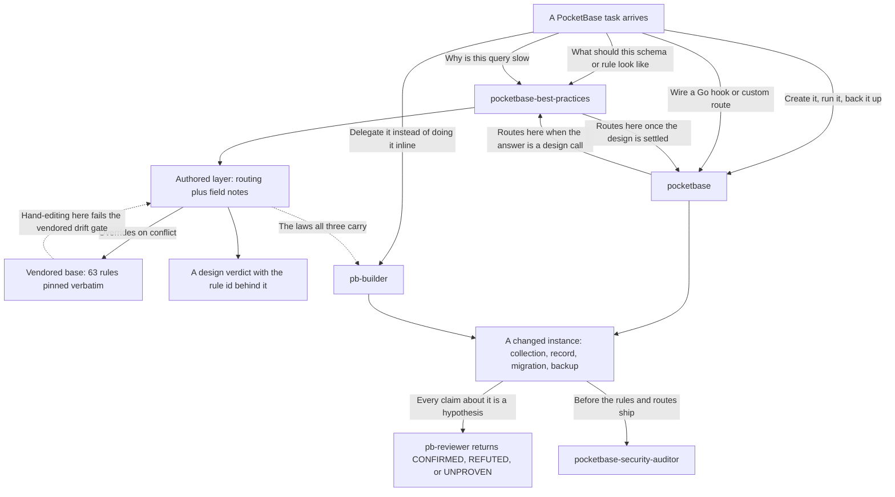

# pocketbase

Two PocketBase skills that split the work by question — how to **build** a backend right, and
how to **drive** a running one — plus three agents that carry the backend laws into a
delegated brief so no brief has to restate them.

## How it fits together



The design skill decides *what to build*; the operational skill *builds it*. Each hands off to
the other when a task crosses the line, so installing one without the other leaves a gap. The
agents are the same knowledge in dispatchable form: `pb-builder` writes, `pb-reviewer` refuses
to take its word for anything, and `pocketbase-security-auditor` reads the authorization
surface for what the other two would not think to question.

## What you get

| Skill | Answers | Origin |
|---|---|---|
| `pocketbase` | Create the collection, run the migration, take a backup, wire a Go hook or custom route (design calls route to `pocketbase-best-practices`) | authored |
| `pocketbase-best-practices` | Should this be an auth or base collection? What rule expresses owner-or-admin? Why is this query slow? | authored layer over a vendored rule set |

**`pocketbase`** — mode detection (standalone binary vs Go package), bootstrap, and eight
stdlib-only Python helpers for auth, collections, records, backups, config, migration
templating, e2e helpers, and health checks; sixteen on-demand references; JS and Go migration
templates.

**`pocketbase-best-practices`** — 63 prioritized rules across nine categories (collection
design, API rules and access control, auth, SDK usage, query performance, realtime, file
handling, deployment, server-side extending), each with an incorrect/correct code pair, under
an authored layer carrying the operational/design routing and **field notes**: verified
findings that extend the rules, with the evidence that established them.

| Agent | Dispatch it for | Access |
|---|---|---|
| `pb-builder` | Scoped backend implementation against explicit acceptance criteria inside an owned file list, with the migration, hook, and rule laws already in its head | read-write |
| `pb-reviewer` | Adversarial verification of a backend claim, re-derived from its cited source and re-run in the reviewer's own clean room | read-only |
| `pocketbase-security-auditor` | The authorization surface — collection rules, custom routes, hooks, realtime subscriptions, relation scoping, role boundaries | read-only |

Each boots its own throwaway server on a port it picks per run, so nothing it does touches an
instance you are using. Each also declares a semantic dispatch **tier** (`pb-builder` is `mid`;
the two review agents are `heavy`) rather than a model name; which model a tier buys is resolved
from one shared map, so a provider change does not touch this bundle.

## Honest scope

The skills work against any PocketBase instance you can reach. The agents assume more: a
project with a PocketBase entrypoint they can run, standalone or Go-extended, and a layout
they can copy into a scratch directory, since every claim they make is proved on a server they booted
themselves. They read the project's own rules and migration laws where it has them, and say so
when it has none rather than inventing a convention. None of the three commits, pushes, or
stages; `pb-reviewer` and `pocketbase-security-auditor` do not write to the tree at all.

## Attribution

`pocketbase-best-practices` composes over a **vendored** upstream body, taken verbatim and
unmodified under its `base/` directory:

- Source: <https://github.com/greendesertsnow/pocketbase-skills>, path
  `skills/pocketbase-best-practices`
- Pinned ref: `c573263e84a2066d0564f428dd8160e74fc54226`
- License: MIT, retained in the skill directory.

The `pocketbase` operational skill is first-party: it has no upstream to pin and is
maintained here.

Full detail, including why `base/` must never be hand-edited, is in each skill's own README.

## Install

```
claude plugin install pocketbase@dotfiles-agents
```

This is the only bundle that ships the two PocketBase skills. They used to also ship in
`solo-skills`; as of decision-020 the topical plugin owns a skill, so enable this plugin to
get them.

## Codex

Install with `codex plugin add pocketbase@dotfiles-agents`. Use Python 3.11 or newer to generate this package’s
project roles with the shared Codex helper from its installed root (the path returned by `codex plugin add --json`):

```sh
python3 "$PLUGIN_ROOT/hooks/_lib/codex_roles.py" /path/to/project --plugin-root "$PLUGIN_ROOT"
```

Start a fresh session and trust the package hooks in `/hooks`. The native `worker-context` and `worktree-isolation` hooks inject
canonical role instructions and enforce each role’s dispatch and patch-tool exclusions.
These roles run without an Atelier activation file. Install Atelier separately for worktree
isolation; shell access remains subject to the role’s instructions and the project sandbox. Setup preserves user-edited profiles and uses the shared OpenAI model tiers.
When Atelier is installed, run its project setup after generating these roles. It reconciles
policy into the sole configured agent's native directory or `.agents/atelier.local.md` when
multiple coding agents are configured; this bundle ships the same policy-selection helpers.
