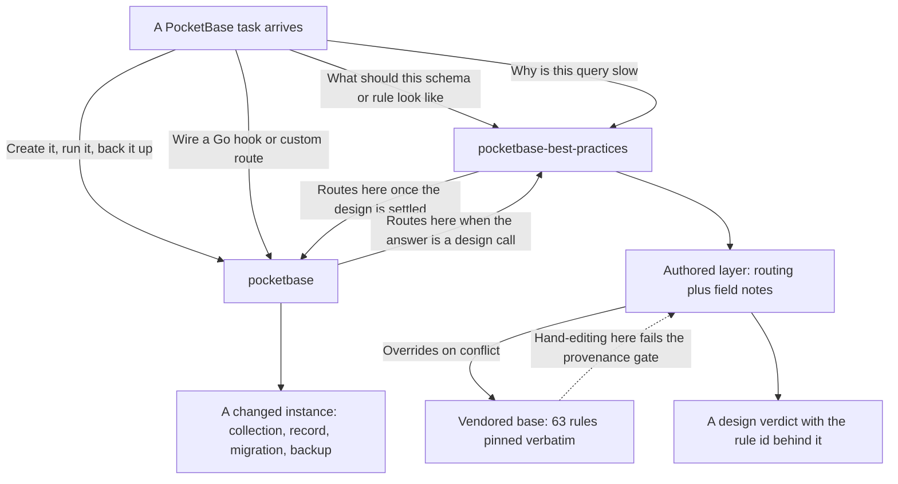

# pocketbase

Two PocketBase skills that split the work by question: how to **build** a backend right, and
how to **drive** a running one.

## How it fits together



The design skill decides *what to build*; the operational skill *builds it*. Each hands off to
the other when a task crosses the line, so installing one without the other leaves a gap.

## What you get

| Skill | Answers | Origin |
|---|---|---|
| `pocketbase` | Create the collection, run the migration, take a backup, wire a Go hook or custom route | authored |
| `pocketbase-best-practices` | Should this be an auth or base collection? What rule expresses owner-or-admin? Why is this query slow? | authored layer over a vendored rule set |

**`pocketbase`** — mode detection (standalone binary vs Go package), bootstrap, and eight
stdlib-only Python helpers for auth, collections, records, backups, config, migration
templating, e2e helpers, and health checks; sixteen on-demand references; JS and Go migration
templates.

**`pocketbase-best-practices`** — 63 prioritized rules across nine categories (collection
design, API rules and access control, auth, SDK usage, query performance, realtime, file
handling, deployment, server-side extending), each with an incorrect/correct code pair, under
an authored layer carrying the operational/design routing and **field notes**: verified
findings that extend the rules, with the evidence that established them.

## Attribution

`pocketbase-best-practices` composes over a **vendored** upstream body, taken verbatim and
unmodified under its `base/` directory:

- Source: <https://github.com/greendesertsnow/pocketbase-skills>, path
  `skills/pocketbase-best-practices`
- Pinned ref: `c573263e84a2066d0564f428dd8160e74fc54226`
- License: MIT, retained in the skill directory.

The `pocketbase` operational skill is first-party: it has no upstream to pin and is
maintained here.

Full detail, including why `base/` must never be hand-edited, is in each skill's own README.

## Install

```
claude plugin install pocketbase@dotfiles-agents
```
