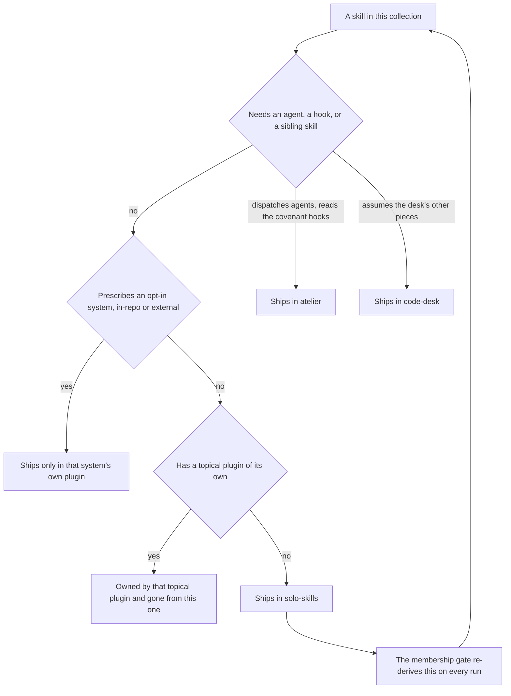

# solo-skills

Codex uses these skills through the existing marketplace, with native tool discovery and process sessions. Skills whose subject is Claude Code still configure Claude Code; they do not configure native Codex memory.

The home for skills that stand on their own and have no topical plugin, in one install. A
skill belongs here when it needs no agent, no hook, and no sibling skill to do its job — so
whichever one you reach for works the moment it activates, with nothing else to set up.

Membership is derived rather than curated. A membership gate in the source repo re-reads every
skill body and every bundled script on each run and works out which ones qualify, so this
plugin cannot admit a skill that grew a dependency or quietly drop one that nothing else
ships.

## How it fits together

Too many skills to draw, and a box per skill would only be the table below. What the table
cannot show is the rule that decides what is here at all — one question, asked of every skill
on every run:



Because the answer is derived rather than recorded, a skill that grows a dependency leaves
this plugin on its own, and one that sheds every dependency and has nowhere topical to live
joins it.

## What you get

**Harness and environment**

| Skill | What it does |
|---|---|
| `claude-code-config` | Configure Claude Code itself — permissions, hooks, env vars, MCP servers, and settings routed to the right file by precedence, closing with a check that the change actually took effect. |
| `claude-code-expertise` | The map of Claude Code's extension surfaces: which surface fits a need, what each one's frontmatter and config contract is, and how to debug one that is not firing. |
| `opencode-expertise` | opencode's extension surfaces end to end, the TypeScript constraint, and how each Claude Code equivalent translates onto them. Reference content — it answers and maps, it does not port. |
| `iterm2` | iTerm2 past its silent failures: the preferences model, dynamic profiles, shell integration, and default-terminal bindings that report success while dropping the change. |
| `opencode-sandbox` | Spin up a disposable, isolated opencode instance and hand it to the session as an MCP server — its workspace is a volume, so it cannot see the host filesystem. |

**Test quality**

| Skill | What it does |
|---|---|
| `test-quality` | Check that a test can actually fail — the pre-write gate ("what production change should make this fail?"), the five-mutation check for tests that already exist, and the four shapes that stay green no matter what the production code does. |

**Research and decisions**

| Skill | What it does |
|---|---|
| `deep-research` | Multi-source investigation ending in a cited report, where every load-bearing claim has to survive an attempted refutation before it is asserted. |
| `tech-eval-research` | Comparative technology evaluation: ranked shortlist, capability matrix, and a recommendation built from primary sources, including license and free-tier boundaries. |
| `owner-signoff` | Put a batch of decisions in a local browser form instead of a wall of chat questions; the answers flow back into the session automatically. |

**Charts and visuals**

| Skill | What it does |
|---|---|
| `dataviz` | Chart design rules to consult *before* writing chart code, in any library: mark selection, the anti-patterns to refuse, and a colorblind-safe palette, closing with the validation checklist to run before delivering. |

**Building software**

| Skill | What it does |
|---|---|
| `api-craft` | HTTP/REST API servers by layer — route, schema, service, repository, model — with the rejection cascade that maps every failure to a status code and outside-in build order. |
| `tui-craft` | Full-screen terminal apps — layering, state ownership, repaint and streaming discipline, key routing, and the fixes for flicker, resize corruption, and a terminal left broken after exit. |

**Repos and projects**

| Skill | What it does |
|---|---|
| `editor-project-config` | Tracked `.vscode/` and `.zed/` folders designed in one pass — associations, toolchain-matched settings, tasks, debug configs, and cross-editor parity. |
| `private-fork` | Run a private mirror of an upstream repo: remotes, branch model, a delete-vs-disable rubric, a divergence ledger, and the merge cycle. Every command it hands you names the upstream tracking ref in full, so a local ref of that name in your fork cannot shadow it. |

## Install

```
claude plugin install solo-skills@dotfiles-agents
```

## Honest scope

**This replaced the one-skill plugins, and that trade is real.** Each of these skills used
to be installable on its own. A plugin is the unit of installation in Claude Code — there
is no way to install one skill out of one — so folding them into a single plugin means
you now take the whole set or none of it. What makes that acceptable is progressive
disclosure: the model reads each skill's one-line description to decide what to activate
and only loads a skill's body when it fires, so carrying the full set costs a set of
descriptions, not a set of skill bodies.

**Skills that need company are not here.** Anything that dispatches an agent, requires a
hook, or reads a sibling skill's files ships in the bundle that carries those pieces:
delegation and waves in `atelier`; board triage in `code-desk`; the repo scaffold and the
compliance audit in `mise-en-place`. Those are not lesser skills, they are skills whose
dependencies a grab-bag cannot satisfy. A second, narrower exclusion is deliberate rather
than derived: a skill that prescribes a system the consumer opts into deliberately ships
only in that system's own plugin, so installing this bundle never pushes those conventions
on a repo that has not chosen them. The system can be in-repo (the `_meta/` planning desk
and its layout standard, in `mise-en-place`) or external (the `bun` toolchain, the
`kenn-forge` daemon, each in a plugin of that name).

**A skill with a topical plugin is not here at all.** The topical plugin owns a skill; this
bundle is the home for the ones with nowhere topical to live (decision-020, 2026-09-08). That
ruling was first executed on four skills — PocketBase work moved to `pocketbase`, the
pull-request and comms skills to `code-desk` — and has now been swept across every skill that
still had two homes. **That shrinks what this bundle ships, and it is a break if you installed
`solo-skills` for one of the eighteen below.** Nothing was duplicated and nothing was deleted:
each of them still ships, from its topical plugin. Enable that plugin to get it.

| Skill that left | Now ships from |
|---|---|
| `carbon-builder` | `carbon` |
| `comment-hygiene` | `atelier` |
| `deletion-pass` | `atelier` |
| `handoff` | `atelier` |
| `layer-cycle` | `atelier` |
| `rubric-panel` | `atelier` |
| `diagrams` | `diagrams` |
| `drawio` | `diagrams` |
| `excalidraw` | `diagrams` |
| `mermaid` | `diagrams` |
| `obsidian-api-basics` | `obsidian-toolkit` |
| `obsidian-chat-ui` | `obsidian-toolkit` |
| `obsidian-cli` | `obsidian-toolkit` |
| `obsidian-mcp-server` | `obsidian-toolkit` |
| `presentations` | `code-desk` |
| `readme-value-and-proof` | `code-desk` |
| `project-memory` | `code-desk` and `mise-en-place` |
| `task-authoring` | `mise-en-place` |

**One skill has two topical homes, deliberately.** Exactly one home is the rule above;
`project-memory` is the recorded exception to it (owner ruling 2026-09-08). `code-desk` owns it
topically, and `mise-en-place` needs it mechanically — that plugin's `audit.py` and
`scaffold.py` both load `skills/project-memory/references/checklist.md` off their own plugin
root and abort without it, so the skill has to travel with them. Either way it is not a
`solo-skills` member; take it from whichever of the two you already have.

**External tools some of these need.** `opencode-sandbox` needs the `opencode-sandbox` CLI
and Docker; `iterm2` needs iTerm2 itself installed locally, since its default-terminal and
shell-integration paths configure the real app; `owner-signoff` needs PyYAML on the system
`python3` to read a YAML spec, and nothing outside the standard library for a JSON one. Each
says so at the point of use.

**Overlaps worth knowing.** `diagrams` covers structural diagrams and `dataviz` covers
data charts — they hand off to each other rather than competing. `claude-code-config`
changes configuration; `claude-code-expertise` explains the surfaces. No member is
dual-homed any more, so nothing here is listed twice in a session that also enables a topical
plugin — that was the whole point of the sweep above, since a skill with two memberships is
one source the harness lists once per enabled plugin, with no way for either to suppress the
other.
