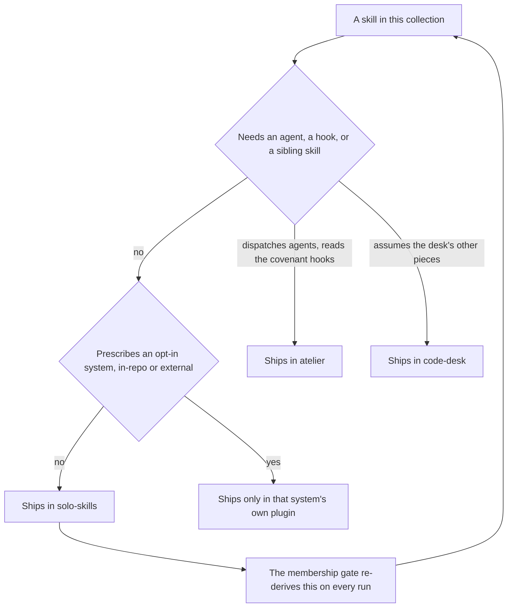

# solo-skills

Every skill in this collection that stands on its own, in one install. A skill belongs
here when it needs no agent, no hook, and no sibling skill to do its job — so whichever
one you reach for works the moment it activates, with nothing else to set up.

Membership is derived rather than curated. A membership gate in the source repo re-reads every
skill body and every bundled script on each run and works out which ones qualify, so this
plugin cannot quietly fall behind the collection or admit a skill that grew a dependency.

## How it fits together

Too many skills to draw, and a box per skill would only be the table below. What the table
cannot show is the rule that decides what is here at all — one question, asked of every skill
on every run:



Because the answer is derived rather than recorded, a skill that grows a dependency leaves
this plugin on its own, and one that sheds a dependency joins it.

## What you get

**Harness and environment**

| Skill | What it does |
|---|---|
| `claude-code-config` | Configure Claude Code itself — permissions, hooks, env vars, MCP servers, and settings routed to the right file by precedence, closing with a check that the change actually took effect. |
| `claude-code-expertise` | The map of Claude Code's extension surfaces: which surface fits a need, what each one's frontmatter and config contract is, and how to debug one that is not firing. |
| `opencode-expertise` | opencode's extension surfaces end to end, the TypeScript constraint, and how each Claude Code equivalent translates onto them. |
| `project-memory` | Where agent memory lives and how it moves — the global/project split, the loading modes, and two scripts to wire a repo for tracked memory or recover it after a move. |
| `iterm2` | iTerm2 past its silent failures: the preferences model, dynamic profiles, shell integration, and default-terminal bindings that report success while dropping the change. |
| `opencode-sandbox` | Spin up a disposable, isolated opencode instance and hand it to the session as an MCP server — its workspace is a volume, so it cannot see the host filesystem. |

**Session discipline**

| Skill | What it does |
|---|---|
| `handoff` | Maintain the session handoff so a cold session can pick the work up — a file this skill writes, or an external tracker it signals via a freshness stamp — the externalization pass that makes a session safe to clear. |
| `dev-focus` | Mid-session focus check that flags drift from the original task, plus a scope triage that sorts a task list into MUST, DEFER, and CUT. |
| `layer-cycle` | Drive a module through create, evaluate, and refine cycles until it converges or the budget runs out, turning findings into scoped fix briefs. |
| `rubric-panel` | Score artifacts against an anchored rubric with a persona-diverse judge panel, classifying each finding as defect, noise, spec-hole, or undeclared commitment. |
| `deletion-pass` | Reduce a module to irreducible against its contract — remove every line that cannot name the commitment it keeps, without changing observable behavior. |
| `comment-hygiene` | Strip history and commentary out of source comments before the work lands — harvest the reasoning onto its tracker item first, then keep only what a competent reader would break something without. |

**Research and decisions**

| Skill | What it does |
|---|---|
| `deep-research` | Multi-source investigation ending in a cited report, where every load-bearing claim has to survive an attempted refutation before it is asserted. |
| `tech-eval-research` | Comparative technology evaluation: ranked shortlist, capability matrix, and a recommendation built from primary sources, including license and free-tier boundaries. |
| `owner-signoff` | Put a batch of decisions in a local browser form instead of a wall of chat questions; the answers flow back into the session automatically. |

**Diagrams and visuals**

| Skill | What it does |
|---|---|
| `diagrams` | The structural-diagram hub — cloud architecture with provider icons via Python's `diagrams` library, raw Graphviz for dependency graphs, and the shared SVG/PNG output pipelines. |
| `mermaid` | Mermaid for GitHub-rendered markdown — flowcharts, sequence, ER, state, and class diagrams, with the house rule that node labels carry no parentheses or special characters. |
| `drawio` | Read, convert, and headlessly export draw.io files — compressed and uncompressed mxGraph XML, legacy-to-Mermaid conversion, and CLI export to PNG/SVG. |
| `excalidraw` | Sketch-style diagrams as `.excalidraw` files, using the Excalidraw MCP tools when a session exposes them and authoring the scene JSON directly when it does not. |
| `dataviz` | Chart design rules to consult *before* writing chart code, in any library: mark selection, the anti-patterns to refuse, and a colorblind-safe palette with a runnable validator. |
| `pptx-themes` | PowerPoint decks with a curated theme layer — semantic tokens, approved palettes, monospaced typography, and a visual QA pass. |

**Building software**

| Skill | What it does |
|---|---|
| `api-craft` | HTTP/REST API servers by layer — route, schema, service, repository, model — with the rejection cascade that maps every failure to a status code and outside-in build order. |
| `tui-craft` | Full-screen terminal apps — layering, state ownership, repaint and streaming discipline, key routing, and the fixes for flicker, resize corruption, and a terminal left broken after exit. |
| `pocketbase` | Operate a PocketBase backend over the REST API or in Go package mode — collection and record CRUD, auth, backups, migrations, hooks, and custom routes. |
| `pocketbase-best-practices` | Design and review rules for a PocketBase backend — schema, API rules, auth flows, query performance, realtime, file handling, and deployment. |
| `carbon-builder` | IBM Carbon Design System for React and Web Components — components, IBM Products UI, Carbon Charts, design tokens, IBM Plex, and Carbon compliance audits, grounded in the hosted Carbon MCP server. |

**Repos and projects**

| Skill | What it does |
|---|---|
| `editor-project-config` | Tracked `.vscode/` and `.zed/` folders designed in one pass — associations, toolchain-matched settings, tasks, debug configs, and cross-editor parity. |
| `private-fork` | Run a private mirror of an upstream repo: remotes, branch model, a delete-vs-disable rubric, a divergence ledger, and the merge cycle. |
| `readme-value-and-proof` | Rewrite a README as an honest pitch backed by screenshots captured from the app actually running, never mockups. |
| `github-project-board` | Stand up and operate one GitHub Project (v2) board — fields including iterations, many views over one item set, dependencies, and the triage cadence. |

**Planning and comms**

| Skill | What it does |
|---|---|
| `comms` | Recurring communication deliverables — morning briefing, end-of-day wrap-up, weekly plan, board readout — shipped as a deck to a consistent standard. |
| `task-authoring` | Write tracked work items a cold agent can execute — titles, acceptance criteria, thresholds, approval gates, and scope ownership, on any tracker. |

**Obsidian plugin development**

| Skill | What it does |
|---|---|
| `obsidian-api-basics` | Obsidian plugin fundamentals — lifecycle (`onload`/`onunload`), settings persistence, the vault API, commands, and ribbon icons. |
| `obsidian-chat-ui` | Chat and conversational interfaces inside an Obsidian plugin: `ItemView`, sidebars, and streaming message rendering. |
| `obsidian-cli` | Drive an Obsidian vault from the terminal for automation and scripting. |
| `obsidian-mcp-server` | Expose vault operations as MCP tools from inside an Obsidian plugin, over Streamable HTTP. |

## Install

```
claude plugin install solo-skills@dotfiles-agents
```

## Honest scope

**This replaced the one-skill plugins, and that trade is real.** Each of these skills used
to be installable on its own. A plugin is the unit of installation in Claude Code — there
is no way to install one skill out of one — so folding them into a single plugin means
you now take the whole set or none of it. What makes that acceptable is progressive
disclosure: the model reads each skill's one-line description to decide what to activate
and only loads a skill's body when it fires, so carrying the full set costs a set of
descriptions, not a set of skill bodies.

**Skills that need company are not here.** Anything that dispatches an agent, requires a
hook, or reads a sibling skill's files ships in the bundle that carries those pieces:
delegation and waves in `atelier`; board triage in `code-desk`; the repo scaffold and the
compliance audit in `mise-en-place`. Those are not lesser skills, they are skills whose
dependencies a grab-bag cannot satisfy. A second, narrower exclusion is deliberate rather
than derived: a skill that prescribes a system the consumer opts into deliberately ships
only in that system's own plugin, so installing this bundle never pushes those conventions
on a repo that has not chosen them. The system can be in-repo (the `_meta/` planning desk
and its layout standard, in `mise-en-place`) or external (the `bun` toolchain, the
`kenn-forge` daemon, each in a plugin of that name).

**External tools some of these need.** `diagrams` needs `graphviz`; `drawio` needs the
draw.io desktop app for headless export; `obsidian-cli` needs the Obsidian binary;
`github-project-board` needs `gh` authenticated; `opencode-sandbox` needs the `opencode-sandbox`
CLI and Docker; `carbon-builder` needs the hosted Carbon MCP server. Each says so at the point of use.

**Overlaps worth knowing.** `diagrams` covers structural diagrams and `dataviz` covers
data charts — they hand off to each other rather than competing. `claude-code-config`
changes configuration; `claude-code-expertise` explains the surfaces. Several of these
skills also ship inside another plugin (`handoff` in `atelier`, the diagram skills in
`diagrams`, the Obsidian skills in `obsidian-toolkit`, the PocketBase skills in `pocketbase`,
`carbon-builder` in `carbon`, `task-authoring` in `kaneo`, and several in `code-desk`);
installing both homes loads each skill once.
