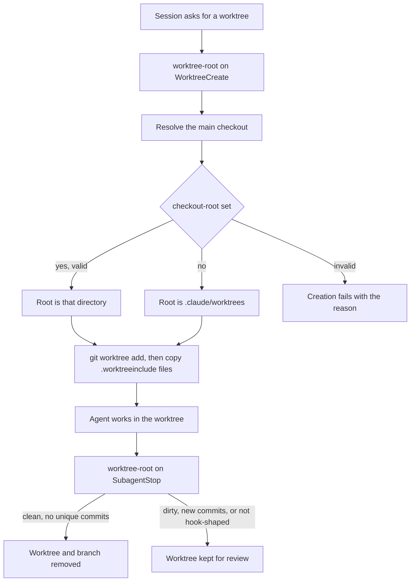

# worktree-root

Claude Code puts every worktree it creates (`--worktree`, `EnterWorktree`, subagent
`isolation: worktree`) under `.claude/worktrees/`, and its `worktree.location` setting is
not read by the CLI. This plugin owns creation instead, so worktrees land under the
directory the project names as its `checkout-root` in the atelier activation file.

Scope: subagent `isolation: worktree` (and `EnterWorktree`) only. A `claude --worktree`
session worktree is created before plugin hooks load, so it stays at the native
location (measured on claude 2.1.281).

## Install

Opt-in per project. Installing it changes where every worktree in that project is
created, so enable it at project scope, not user scope:

```
claude plugin install worktree-root@dotfiles-agents --scope project
```

or add it to the project's `.claude/settings.json`:

```json
{ "enabledPlugins": { "worktree-root@dotfiles-agents": true } }
```

For an already installed plugin, `claude plugin enable worktree-root@dotfiles-agents`
turns it on. Then set the root in the activation file:

```markdown
---
checkout-root: .worktrees
---
```

Without the key, worktrees keep the native `.claude/worktrees/` placement.

## How it fits together



## What it does

| Hook | Fires | Does |
|---|---|---|
| [`worktree-root`](hooks/worktree-root/README.md) | `WorktreeCreate`, `WorktreeRemove`, `SubagentStop` | Creates worktrees under `checkout-root` with native branch naming, base ref and `.worktreeinclude` copying; removes them on `ExitWorktree` remove and after a clean subagent |

Once a WorktreeCreate hook owns creation, the harness skips its own `.worktreeinclude`
copy and keeps every agent worktree, so the hook restores both. Removal, after a
subagent or on `ExitWorktree`, touches only a worktree shaped like one this hook creates
(`<root>/<name>` on branch `worktree-<name>`) that has no uncommitted or untracked
change and no commit other refs lack. Anything else is kept, and `ExitWorktree` reports
why. With the key set, a native `.claude/worktrees` path, such as one a `claude
--worktree` session made, is also accepted for removal under the same checks.

A repo using `--separate-git-dir`, or a session inside a submodule, has no main checkout:
there the plugin keeps native placement under the toplevel's `.claude/worktrees`, and
refuses a `checkout-root` key.

## Honest scope

Claude Code only. Like native creation it refreshes `origin` before branching when the
last fetch is over a day old, but it reads `worktree.baseRef` from settings files, so
`--settings`, `--setting-sources` and managed settings can make its base differ from
native. It does not handle `worktree.symlinkDirectories` or `worktree.sparsePaths`, does
not git-lock `--worktree` sessions, and a worktree under a `checkout-root` cannot be
re-entered with `EnterWorktree` by path. It does not clean up worktrees left behind by
`--worktree` sessions, which native creation keeps too. The hook README lists the rest.
