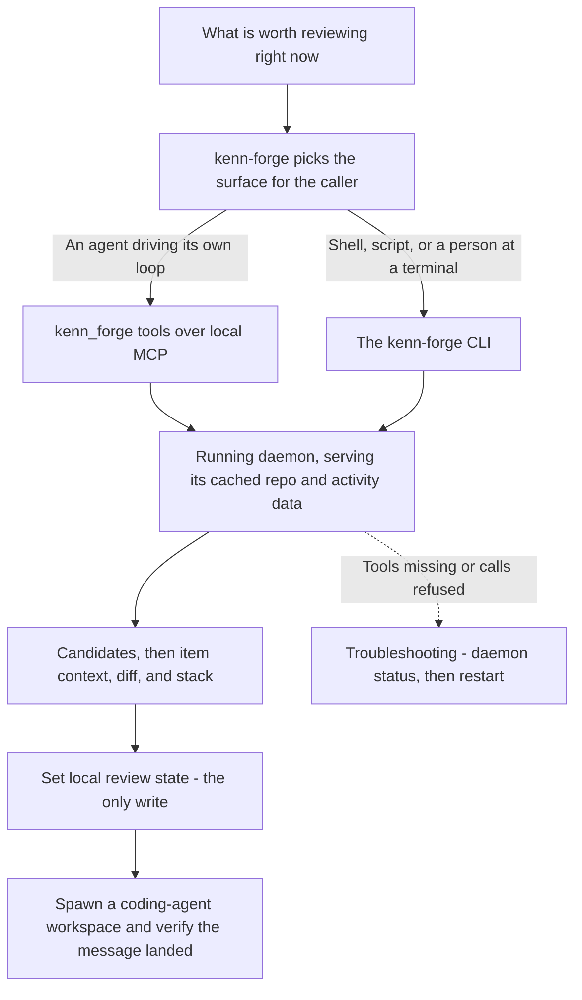

# kenn-forge

Maintainer-workflow triage over a running [kenn-forge](https://github.com/kenn-io/forge)
daemon: find the PRs and issues worth reviewing, read diffs, CI, and stack context, track
local review state, and hand work off to a coding agent — without leaving the session.

## How it fits together



## When it triggers

Anything touching kenn-forge: finding PRs or issues worth reviewing, inspecting a diff or
a stack, marking something reviewing/waiting/merged, spawning a coding-agent workspace, or
running any `kenn-forge` subcommand.

## Requires

A running kenn-forge daemon (`kenn-forge daemon status`). The MCP tools additionally need
`[mcp].enabled = true` in the daemon's config and the server registered with the client:
`claude mcp add --transport http kenn-forge http://127.0.0.1:8092/mcp`. Without the daemon
the skill has nothing to read — it is a client, not a data store.

## Provenance

**Self-authored (`origin: authored`). No upstream exists to pin.** The kenn-forge project
publishes no such skill: its own `skills/` directory carries internal development tooling
only, and there is no package or formula shipping this content. It is operator prose about
a third-party daemon, written here — see the "Not externals" note in `externals.yaml`.

## Install

```
claude plugin install kenn-forge@dotfiles-agents
claude plugin install solo-skills@dotfiles-agents
```
