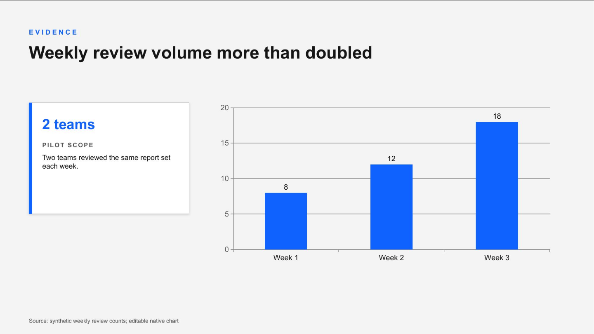
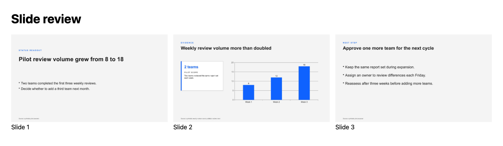

# presentations

Create an editable PowerPoint deck, keep its source, and inspect the rendered result
before sharing it. `presentations` ships in **code-desk** and replaces `pptx-themes`.

## Why this exists

A recurring briefing should not start with choosing colors, rebuilding slide helpers,
or chasing an absolute path into a plugin cache. This skill brings the existing authored
palettes, typography and narrative workflow into a portable deck project. It also gives
you a way to inspect and make focused changes to an existing deck without rebuilding it.

## What you get today

- **Editable source you can keep:** generate a small PptxGenJS project with local helpers,
  a native chart and speaker notes. Customize the source and build it outside this repo.
- **A consistent visual starting point:** seven semantic themes, typography guidance and
  narrative patterns. Status, advisor and client starters supply illustrative content.
- **Focused existing-deck operations:** inspect text, notes, fonts and chart parts; replace
  exact paragraphs; fill template text; reorder, split, duplicate and merge supported decks.
- **A reviewable output:** render PDF, slide images and a labeled review grid, then check
  package structure and inspect the visuals before delivery.

This is an authoring workflow, not an automatic finished presentation. Supply the real
content and review every layout. Paragraph edits adopt the first run's formatting;
arbitrary object/chart edits use the source or a native application. Merge and template
preservation have [explicit boundaries](references/editing.md). Structural validation
is **not full ISO/ECMA schema conformance**, and rendering needs installed fonts and tools.

## See it working

These are unedited Chromium screenshots of the actual rendered output from a generated
source package. The pilot scenario and every figure are synthetic; no customer account,
client identifiers or credentials were used. The chart remains a native editable chart
in the PPTX. Speaker notes and embedded chart content are checked separately from pixels.



The same render command produces this review grid for checking the opening, evidence
and decision together. These are three working example slides, not a complete customer deck.



Captured at a fixed 1440-pixel width with headless Chromium after PptxGenJS generation and LibreOffice
conversion; both pages loaded all images with zero browser console/page/request errors.
The screenshots are documentation evidence. Generated deck packages and rendered
PPTX/PDF output remain outside the tracked source tree.

## Start here

Install the bundle and open [SKILL.md](SKILL.md) for the creation and review workflow:

```sh
claude plugin install code-desk@dotfiles-agents
```

From this skill's directory, with an existing output parent:

```sh
python3 scripts/create-deck.py --type advisor --slug board-readout --out /tmp/board-readout
cd /tmp/board-readout
npm install --ignore-scripts
node deck.js
```

Authoring needs Node/npm. Rendering needs Poppler plus LibreOffice or Microsoft PowerPoint
on macOS. Python's stdlib handles package creation, inspection and focused editing;
repository CI remains zero-install. The official PptxGenJS release stays unchanged;
generated projects [omit its unused vulnerable image parser](references/migration.md#unused-image-parser-removal).

Existing `deck.js` sources and comms `slides.json` workflows remain supported. Follow
[migration](references/migration.md) when moving old theme imports or dependency manifests.

## Roadmap

- In the source checkout, follow the [replacement roadmap](../../../docs/presentations-replacement.md#roadmap)
  for the live review and tracker; installed copies contain the working skill and proof images.
- Retire the temporary parser substitute after the
  [upstream dependency removal](https://github.com/gitbrent/PptxGenJS/pull/1529)
  reaches a verified release.

## Provenance

The palettes, narrative and typography are the retained authored layer. The small layout
helper comes from the owner's `spike-make-decks` experiment; package/editor/render tools
are independently authored. The [source-checkout replacement record](../../../docs/presentations-replacement.md)
records provenance and capability decisions. No Anthropic base implementation, instructions
or nested schemas are included. PptxGenJS is a separately installed MIT dependency;
this skill does not grant a blanket license over the marketplace's work.
